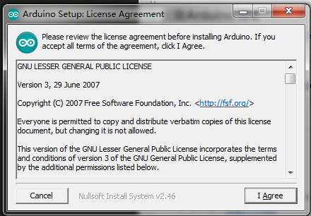
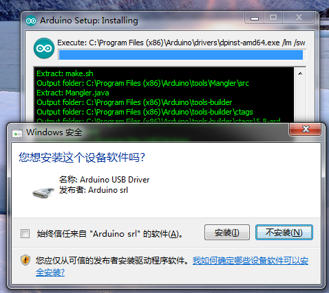
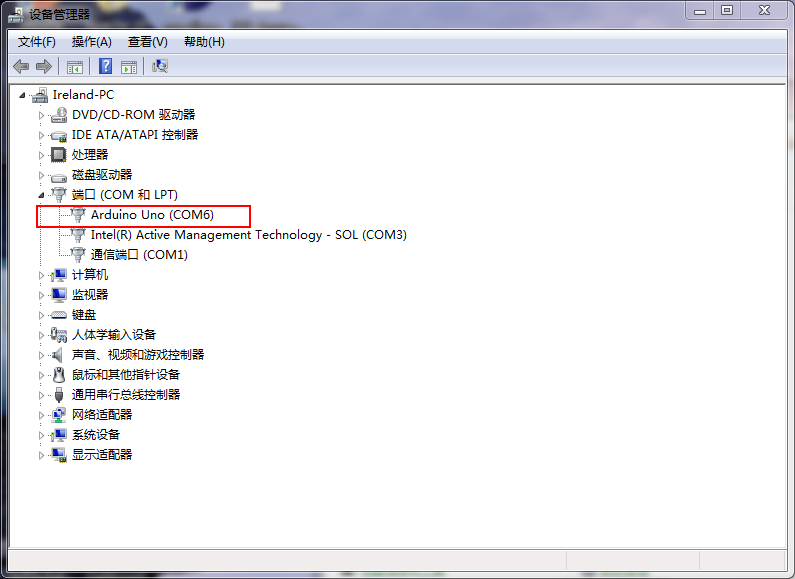
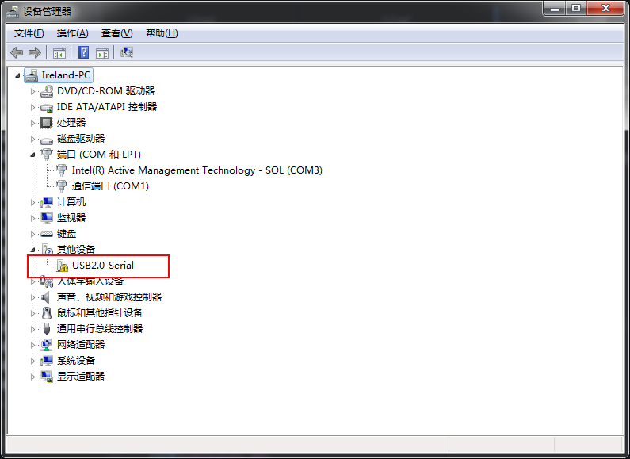
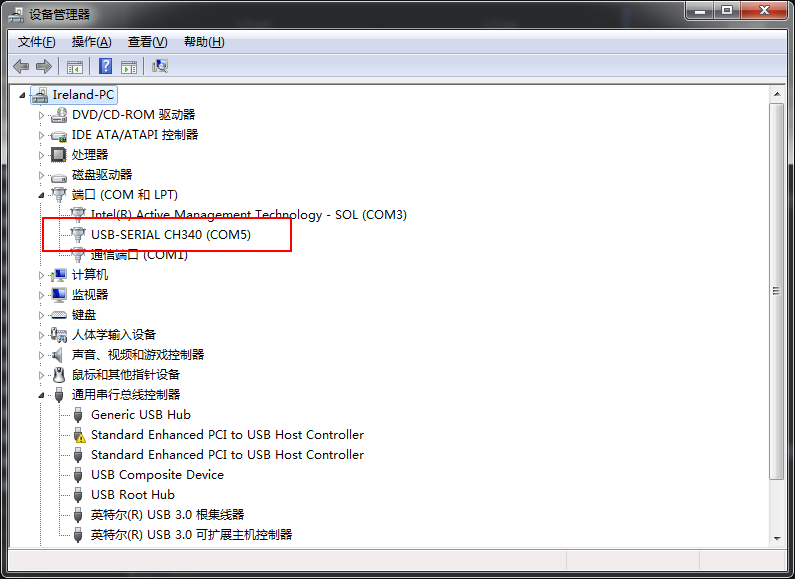
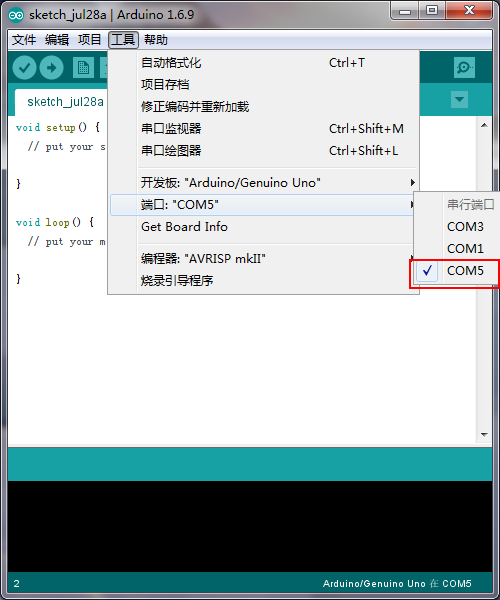
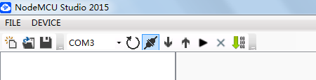
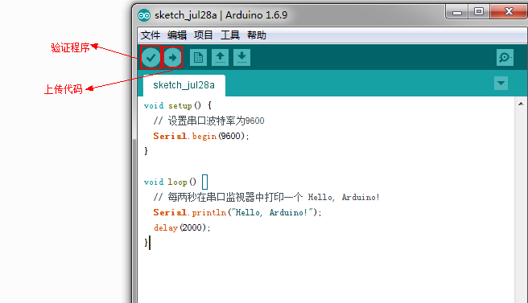
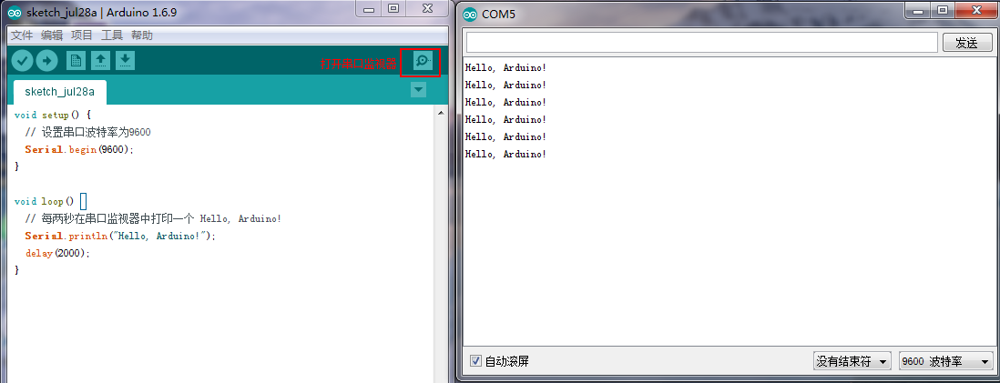

# Arduino开发环境搭建
## Arduino简单介绍
Arduino是一款开源的电子原型平台，它适合做快速的开发，并且学习成本很低。Arduino语言是基于C/C++的，具体的语法可以参考http://www.arduino.cn/reference/ ，相信看一眼就很清楚了。另外，Arduino也有电子积木之称，市面上有很多Arduino的模块，比如说我们用到的以太网模块就是一种，我们开发arduino的时候会像玩儿积木一样把各种模块拼装在一起。
## 环境搭建
### 安装Arduino IDE
1、首先下载安装包，读者可以去https://www.arduino.cc/en/Main/Software 下载所需的安装包。如果是Windows系统，就选择Windows Installer。  
接下来打开exe安装包，按照正常的步骤安装就Okay了。<br>
<br><br>

2、在安装即将完成的时候，会弹出是否安装驱动的提示，这里选择安装驱动就好了。<br>
<br><br>

3、插入Arduino Nano开发板，打开控制面板，并打开设备管理器。<br>
<br><br>

如果能看到以下的图，就说明安装成功了。(这里以Arduino UNO板为例)<br>
  

### 驱动安不上咋办?
笔者在安装完Arduino IDE之后，遇到的情况并不理想，是这样的。<br>
<br><br>

很显然，驱动没有安上。后来经过一番查找，发现是淘宝上的芯片是用的假的驱动芯片，比如说我这款用的是CH340的驱动，而非Arduino本身的驱动，所以从网上下一个CH340的驱动安装上就好了，安装好了如下图。<br>


## 第一个程序：Hello, Arduino!
到现在为止，环境就搭建好了，我们打开Arduino IDE，首先点击工具，配置合适的端口号，端口号可以参考设备管理器上的名字，比如说我的是COM5<br>
<br><br>

接下来选择开发板型号，选择Arduino Nano开发板。<br>
<br><br>

下面我们开始写我们的第一个Arduino代码。  
``` arduino
void setup() {
  // 设置串口波特率为9600
  Serial.begin(9600);
}

void loop() {
  // 每两秒在串口监视器中打印一个 Hello, Arduino!
  Serial.println("Hello, Arduino!");
  delay(2000);
}
```
如果不懂串口是什么的话，并没有关系，会在1.4节讲到。接下来我们把程序代码上传到开发板上。<br>
<br><br>

上传成功之后，打开串口监视器，我们就可以看到输出的“Hello, Arduino!”了。<br>

## 链接
- [目录](directory.md)  
- 上一节：[单片机开发——Arduino](1.0.md)  
- 下一节：[点亮一个Led](1.2.md)
