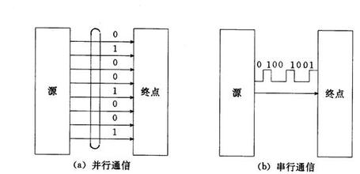
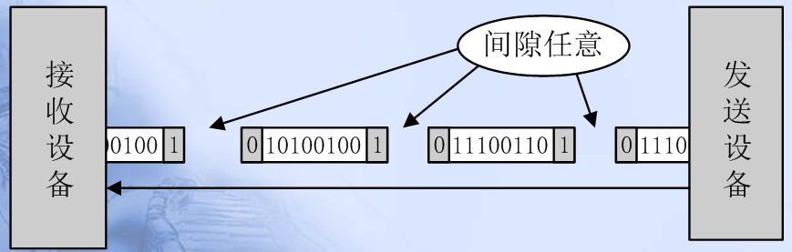
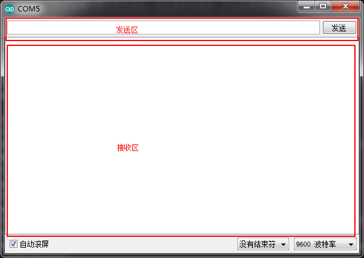
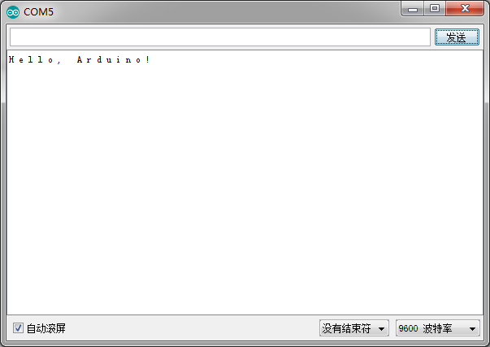

# UART的使用

## UART的介绍
这节课来介绍UART，也就是串口通信。先看一下百度百科上对UART的定义。
> UART是一种通用串行数据总线，用于异步通信。该总线双向通信，可以实现全双工传输和接收。

这里，我主要提取三个关键词来分别解释，第一个“串行”，第二个“异步”，第三个“全双工”。<br>
### 串行与并行
先来说说什么是串行和并行总线。<br><br>

以下这样图可以很好的解释。串行也就是只有一根线，一个周期传送1个bit，8个周期传送1个byte，速度传送较慢。并行通信采用多根总线，比如说8根总线的话，一个周期就可以传送一个byte，不过并行通信的缺点是传输距离短。<br>


### 异步通信与同步通信
再来说说什么是异步通信与同步通信。<br><br>

同步通信就是需要发送方和接收方有一个时钟，在同一个时钟下来进行需要数据的传输。而异步通信发送方和接收方有着自己的时钟，通过起始位和停止位来判断是否有数据，为了保证数据传输的可靠性，还会有一些校验位，用于判断数据是否有效，如奇偶校验等，读者可以自行百度了解。<br><br>

同步通信示意图：（图是百度上找的）<br>
<br><br>

异步通信示意图：（图中的0代表起始位，1代表停止位。）<br>
<br>

另外，对于异步通信来说，还有一个不得不说的，就是波特率（每秒钟传送字符的速率），虽然异步通信不要求时钟严格一致。但是，发送端和接收端的时钟的周期也应该是一样的，这样才能保证接收端有效的对接受的数据进行判断。<br><br>

常见的波特率有：300、600、1200、2400、4800、9600、19200、38400、43000、56000、57600、115200。

### 单工、半双工和全双工
最后再看看什么是单工、半双工和全双工。<br><br>

其实概念很简单，通俗的来讲，单工就是只有一方可以发送数据，比如打印机，只接受数据。半双工就是两方都可以发送数据，但不能同时发送数据，比如对讲机，只能同时听一个人说话。而全双工则是两方可以同时传送数据，比如打电话，对方说着说着有那块说的不对了，你给他打断了。<br><br>

这张示意图可以很好的解释：<br>
<br><br>

下图为两个设备(单片机和电脑或单片机之间)通过串口通信的接线图，将一方的RXD(接受数据端)接到另一方的TXD()，就接受另一方发送过来的数据；将一方的TXD接到另一方的RXD，就可以给另一方发送数据。<br>


## UART的使用
通过上面的介绍，可以知道，串口就是Arduino和电脑(或其他设备)之间进行通信的桥梁，比如说，我们上传程序的时候，就是通过串口的方式上传的。<br><br>
回想一下我们的第一个Arduino程序。
``` arduino
void setup() {
  Serial.begin(9600);
}

void loop() {
  Serial.println("Hello, Arduino!");
  delay(2000);
}
```
这里Serial.begin(9600)就是代表串口的初始化，把波特率设置为9600。之后Serial.println()会通过串口给电脑发送数据。串口通信是双工的，Arduino除了给电脑发送数据之外，还可以接受来自电脑的数据，打开串口监视器，上方就是电脑给Arduino发送数据的地方，下方则是接收到的数据。<br>
<br><br>

接下来看一个发送与接受的例子，这个例子将电脑发送给单片机的数据，通过单片机后又返回给电脑。
```
char temp;

void setup() {
  Serial.begin(9600);
}

void loop() {
  while(Serial.available()){ //如果电脑给单片机发送了数据,就把同样的数据发送回去.
    temp=Serial.read();
    Serial.print(temp);
    Serial.print(" ");
  }
  delay(1);
}
```
上传程序过后，打开串口监视器，在发送区输入“Hello, Arduino!”并发送，看看接收区会不会收到返还的数据。<br>
<br><br>

Okay，到现在UART的学习就学完了，单片机的部分也暂时结束了，在下一章当好中，我们将会用winform开发一个简单地串口调试助手(串口监视器)，从而用电脑控制我们的Arduino。
## 链接
- [目录](directory.md)  
- 上一节：[PWM操作](1.3.md)  
- 下一节：[上位机开发——.Net](2.0.md)
