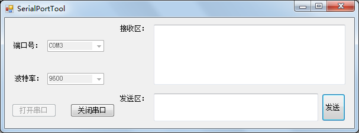
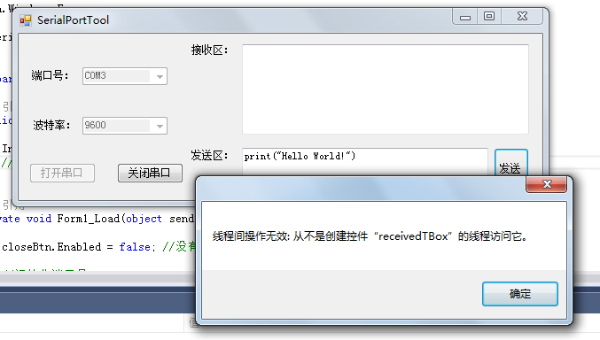
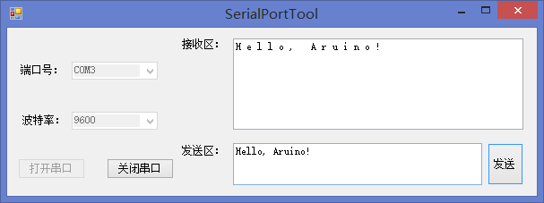

# serialport控件使用
## 说明
这一节，我们将完成一个简易的串口调试助手。并用Nano开发板来测试我们的串口助手。

## 界面布局
首先创建一个工程，我这里起名叫做“SerialPortTool”。我们先完成以下界面的布局。<br>
  <br>
接下来为各个控件修改一下名字：<br><br>
端口号	---》portComboBox<br>
波特率	---》	baudRateComboBox<br>
打开串口	---》	openBtn<br>
关闭串口	---》	closeBtn<br>
接收区	---》	receivedTBox<br>
发送区	---》	sendTBox<br>
发送	---》	sendBtn<br>
在Form_Load中初始化各个控件：<br>
``` csharp
private void Form1_Load(object sender, EventArgs e)
{
    closeBtn.Enabled = false; //没有打开串口时，无法点击关闭串口

    //初始化端口号
    for (int i = 1; i <= 20; i++)
    {
        portComboBox.Items.Add("COM" + i);
    }
    portComboBox.SelectedText = "COM1";

    //初始化波特率
    string[] baudRates = {"300","600","1200","2400",
                             "4800","9600","19200",
                             "38400","43000","56000",
                             "57600","115200" };
    foreach (string baudRate in baudRates)
    {
        baudRateComboBox.Items.Add(baudRate);
    }
    baudRateComboBox.SelectedText = "9600";
}
```
## 添加SerialPort控件
我们搜索SerialPort控件后，直接双击它就可以添加到窗体中，不过这个控件和其他的不太一样，它没有显示在界面中，不过自己想想的话，它也不需要在界面中有什么显示，只需要后台跑，监听串口就好了。<br>
  <br>
选中SerialPort控件，然后选中它的事件，我们可以看到这里有一个DataReceive的事件，也就是接收到数据，就会调用这个方法。<br>
  <br>
在DataReceive中，我们需要把接受到的数据追加到接收区的后面。输入serialPort1之后再输入一个点，然后输入read，我们这是可以看到和read相关的方法。这里有一个叫ReadExisting的方法，就是把所有的数据都读出来。用这个就好了。<br>
``` csharp
private void serialPort1_DataReceived(object sender, System.IO.Ports.SerialDataReceivedEventArgs e)
{
    try
    {
        string receivedText = serialPort1.ReadExisting();
        receivedTBox.Text += receivedText;
    }
    catch (Exception ex)
    {
        MessageBox.Show(ex.Message);
    }

}
```
接下来我们要处理串口打开和关闭以及发送的相关的操作了，serialPort下面很容易就找到相关操作的代码了。我这里直接把后面的部分完成了。
``` csharp
//打开串口
private void openBtn_Click(object sender, EventArgs e)
{
    try
    {
        serialPort1.PortName = portComboBox.Text;
        serialPort1.BaudRate = int.Parse(baudRateComboBox.Text);
        serialPort1.Open();
        openBtn.Enabled = false;
        closeBtn.Enabled = true;
        //打开串口之后波特率和端口号就不能改了
        baudRateComboBox.Enabled = false;
        portComboBox.Enabled = false;
    }
    catch (Exception ex)
    {
        MessageBox.Show(ex.Message);
    }
}

//关闭串口
private void closeBtn_Click(object sender, EventArgs e)
{
    try
    {
        serialPort1.Close();
        openBtn.Enabled = true;
        closeBtn.Enabled = false;

        baudRateComboBox.Enabled = true;
        portComboBox.Enabled = true;
    }
    catch (Exception ex)
    {
        MessageBox.Show(ex.Message);
    }
}

//发送数据
private void sendBtn_Click(object sender, EventArgs e)
{
    try
    {
        serialPort1.WriteLine(sendTBox.Text);
    }
    catch (Exception ex)
    {
        MessageBox.Show(ex.Message);
    }
}
```
## 用Arduino测试
Okay，程序写好了，我们先为开发板烧写1.4节的程序，然后通过自己写的串口助手连接上Arduino开发板，选择打开串口。<br>
  <br>
打开成功，然后在发送区输入“Hello, Arduino!”。
  <br>
不过好像很不幸，程序失败了。这个情况我之前也没有遇到过，于是我百度了一下，有人说在窗体的构造函数处添加一行代码就可以。修改后的构造函数如下：
``` csharp
public Form1()
{
    InitializeComponent();
    //取消跨线程检查
    Control.CheckForIllegalCrossThreadCalls = false;
}
```
  <br>
这样就测试成功了。成功输出了:“H e l l o ,   A r d u i n o ! ”。<br><br>
不过这个程序还是有很多小问题的，比如说接受很多数据，但是接收区无法自动滑动到底端，还有窗口的大小可以任意调整。我稍微修改了些代码，放在了本节源码文件下的SerialPort2目录中。有兴趣可以看看。
## 链接
- [目录](directory.md)  
- 上一节：[winform快速入门](2.1.md)  
- 下一节：[移动开发——Android](3.0.md)
