# Objective-C语言快速入门

## OC初探
Objective-C是一门面向对象的语言，是开发iOS的一门编程语言。它和C++一样都是对C语言的扩充，可以简称为：OC。OC对C语言的语法完全兼容，在C语言上添加了面向对象的特性。<br><br>

下面，我们打开Xcode，选择“Create a new Xcode Project”。<br>
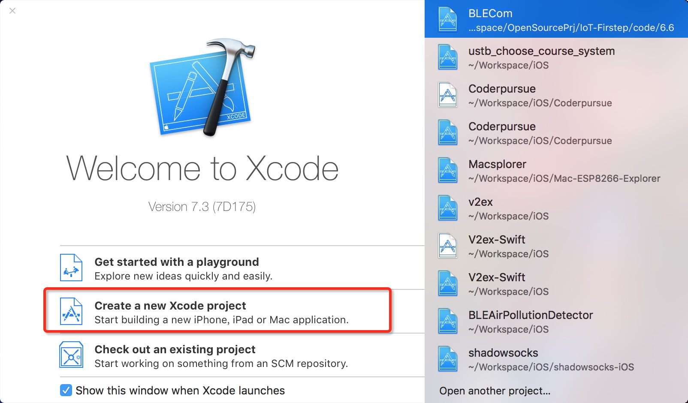<br><br>

选择创建工程之后，我们会进入到一个新的界面，来选择创建项目的类型。这里一共显示出了目前苹果公司使用的四种操作系统。iOS：iPhone、iPad设备的操作系统，是我们的重点；watchOS：苹果表的操作系统；tvOS：苹果电视的操作系统；OS X：苹果笔记本的操作系统。我们将首先像最开始学习C语言的时候一样，先创建一个CLI程序，所以选择“OS X”下的Application中的“Command Line Tool”。<br>
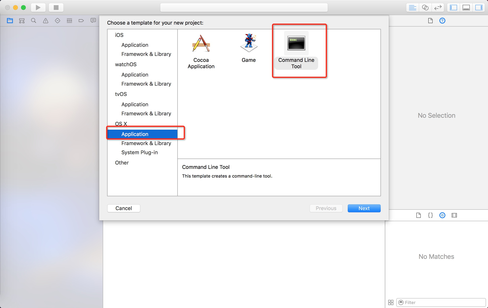<br><br>

接下来，我们需要输入项目名称以及项目的组织名，我这里把工程名设为“study_oc”，组织名和工程名将构成包名，用来唯一区别我们的应用，我这里把它设为“kalen.test”。<br>
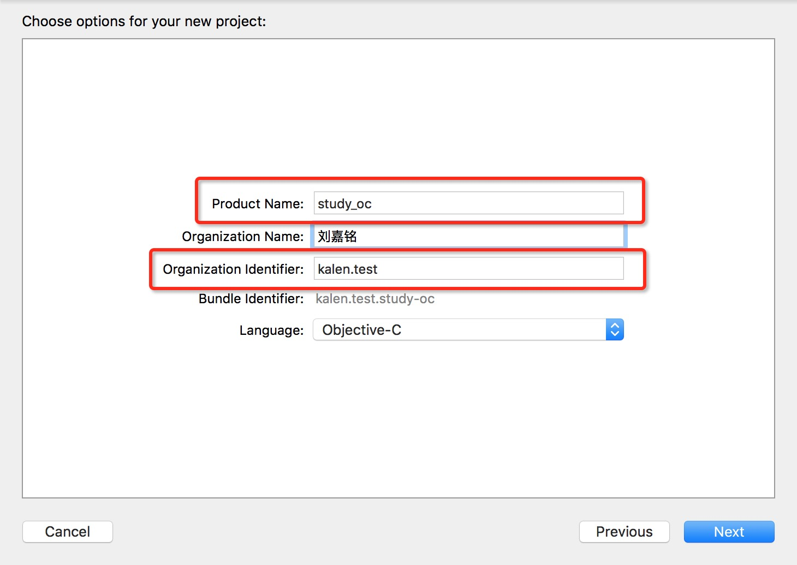<br><br>

点击“Next”后，会弹出保存的地点，这个可以根据读者自己来定。工程创建完成后，我们将看到study_oc文件夹下有一个“main.m”文件，OC的文件和c以及c++一样，包含头文件和源文件，头文件是以“.h”结尾，源文件以“.m”结尾。<br><br>

打开main.m文件，我们可以看到代码如下：
```  objc
#import <Foundation/Foundation.h>

int main(int argc, const char * argv[]) {
    @autoreleasepool {
        // insert code here...
        NSLog(@"Hello, World!");
    }
    return 0;
}
```
这里main函数的定义和C语言都一样。在头文件上，它引入了“Foundation/Foundation.h”，Foundation是苹果的标准库，还有个库叫做UIKit，它是开发UI的标准库。这里比较奇怪的就是“@autoreleasepool”，这是OC负责内存管理的。由于内存管理牵扯较多，在本教程中，不会涉及到这部分的内容，所以读者有兴趣的话可以自行查阅资料。<br><br>

跳过了库的引用以及内存管理后，剩下的只有一条语句了，就是NSLog。我们现在点击左上角运行图标运行一下。<br>
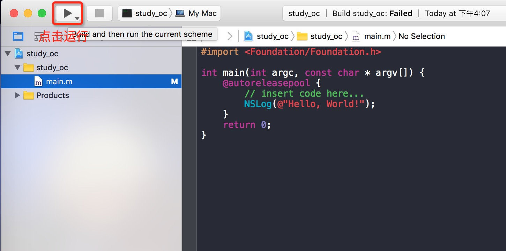<br><br>

可以看到在Xcode下方的控制台中打印出了“Hello World”，而且带着时间前缀。<br>
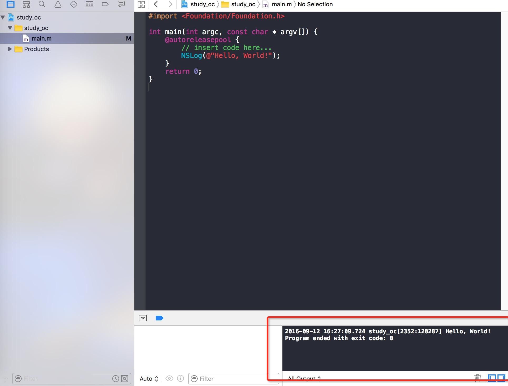<br><br>

在NSLog中的参数是@"Hello, World!"，而非"Hello, World!"。前者代表了NSString，而后者代表了C语言中的字符串。我们可以看以下代码来体会一下。
```  objc
#import <Foundation/Foundation.h>

int main(int argc, const char * argv[]) {
    @autoreleasepool {
        NSString* nsstr = @"Hello World!";  //OC中的字符串
        int int_val = 10;                   //整型
        char* c_str = "Hello World!";       //C语言中的字符串
        NSLog(@"\nThe NSString is: %@;\nThe int val is: %d;\nThe C String is: %s", nsstr, int_val, c_str);
    }
    return 0;
}
```
## 创建一个“类”
简单接触了OC之后，我们开始学习面向对象的知识，首先我们先创建一个类。右键项目文件夹，选择“New File”。<br>
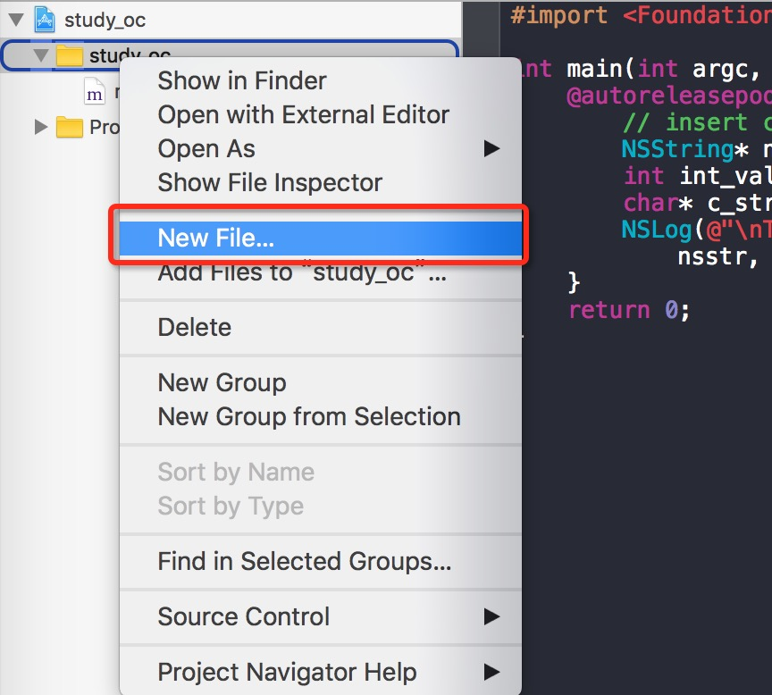<br><br>

我们选择创建一个“Cocoa Class”，点击“Next”。<br>
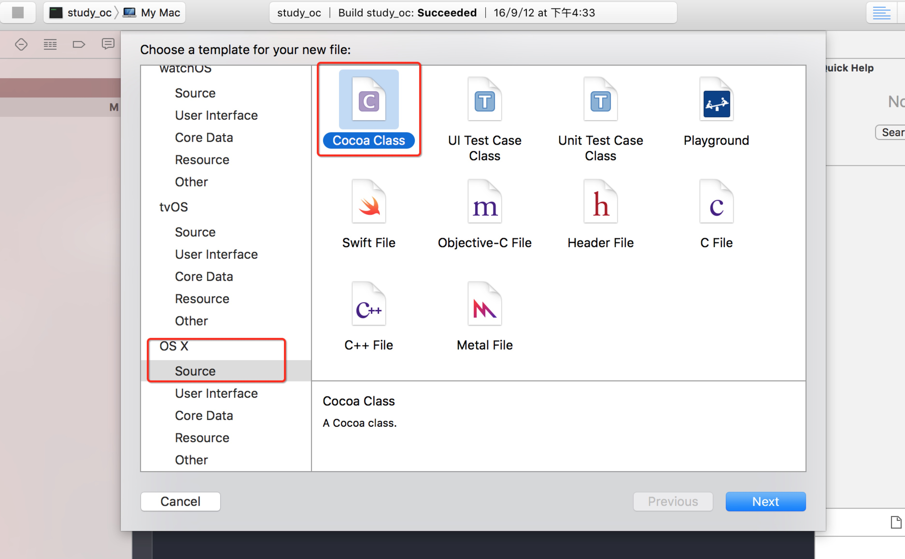<br><br>

给类起名为“Man”，，点击“Next”。<br>
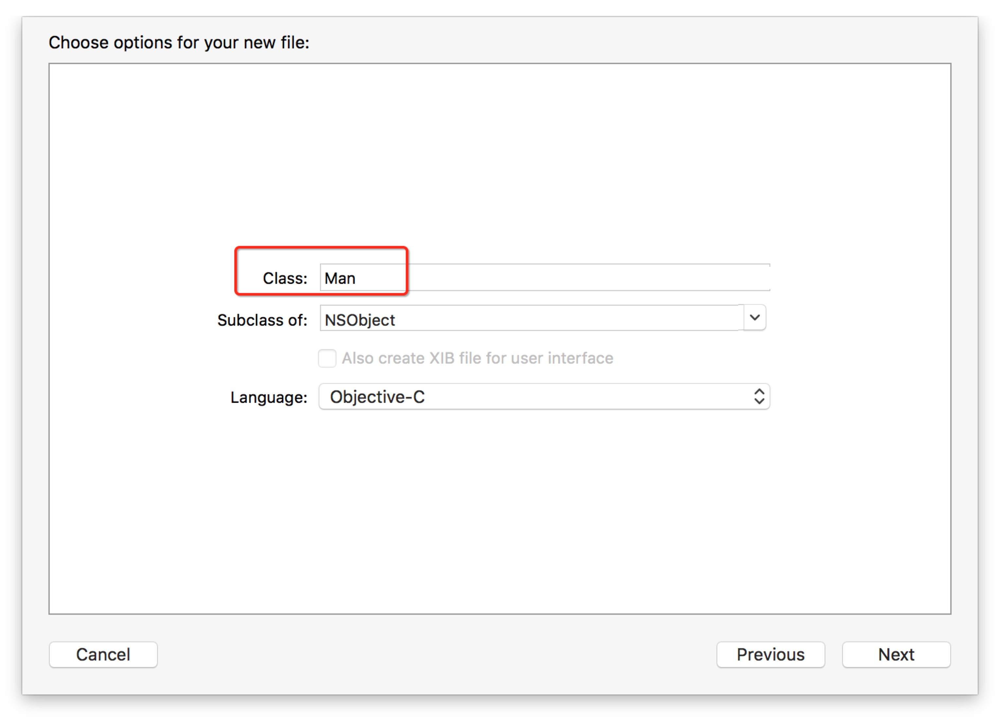<br><br>

这时会弹出选择文件存放的地方，我们默认就好了，点击“Create”之后，就可以看到系统为我们创建了“Man.h”和“Man.m”两个文件，我们的类就算创建好了。<br>
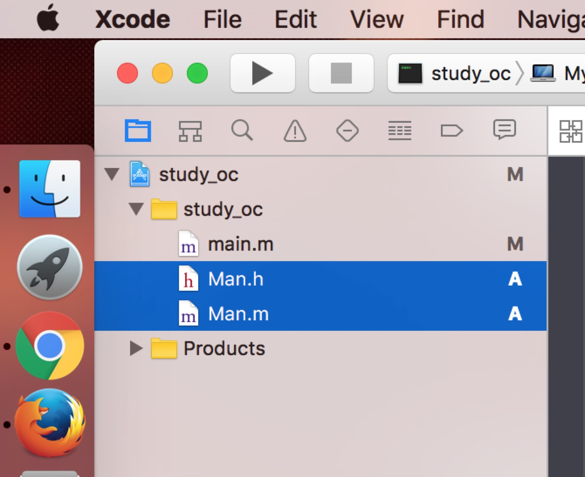<br><br>

接下来，我们在main.m中通过import语句来导入Man类，通过以下代码就可以实例化我们的对象。
```  objc
#import <Foundation/Foundation.h>
#import "Man.h"

int main(int argc, const char * argv[]) {
    @autoreleasepool {
        Man *man = [[Man alloc] init];
    }
    return 0;
}
```
## “类”的方法
下面，我们给Man这个类添加一个方法“say”，并让它打印字符串的功能。修改Man.h如下：
```  objc
#import <Foundation/Foundation.h>

@interface Man : NSObject

-(void) say: (NSString*) what;

@end
```
修改Man.m如下：
```  objc
#import "Man.h"

@implementation Man

-(void) say:(NSString *)what
{
    NSLog(@"say:%@", what);
}

@end
```
在OC中，没有public和private的概念，所有声明在头文件里面的函数都可以认为是public的，而声明在源文件里面而没有声明在头文件的函数则可以认为是private的。<br><br>

在OC中如果方法开头是'-'，则代表这个方法是个实例方法，而如果开头是‘+’，则代表这个方法是个类方法。<br><br>

另外，OC中不允许函数重载，函数名包括除参数以外的符号，比如我们下面创建几个方法。
```  objc
#import <Foundation/Foundation.h>

@interface Man : NSObject

//函数名为:"say"
-(void) say;
//函数名为:"say:"
-(void) say: (NSString*) what;
//函数名为:"say:AndSay:"
-(void) say: (NSString*) what AndSay:(NSString*) what2;

@end
```
我们可以通过以下方式对方法进行调用。
```  objc
#import <Foundation/Foundation.h>
#import "Man.h"

int main(int argc, const char * argv[]) {
    @autoreleasepool {
        Man *man = [[Man alloc] init];

        [man say];
        [man say:@"HaHa"];
        [man say:@"HaHa" AndSay:@"HeHe"];
    }
    return 0;
}

```


## “类”的属性
下面我们给Man这个类添加一个属性"name"，在Man.h和Man.m分别添加以下代码。<br><br>

Man.h
```  objc
@property NSString* name;
```

Man.m
```  objc
@synthesize name;
```
添加之后，我们相当于创建了这两个方法。
```  objc
- (NSString*)name;   
-(void)setName:(NSString*)newName;  
```
我们此时可以通过setName来设置名字，通过name方法来获取名字，如下：
``` objc
[man setName:@"Kalen"];
NSLog(@"%@", [man name]);
```
当然，此时你也可以使用点语法来对name进行操作，这就方便多了。
``` objc
man.name = @"Bill";
NSLog(@"%@", man.name);
```

## “类”的构造方法
下面我们来看看类的构造方法，我们在Man.m中输入“init”几个字母后可以看到一段代码补全提示。<br>
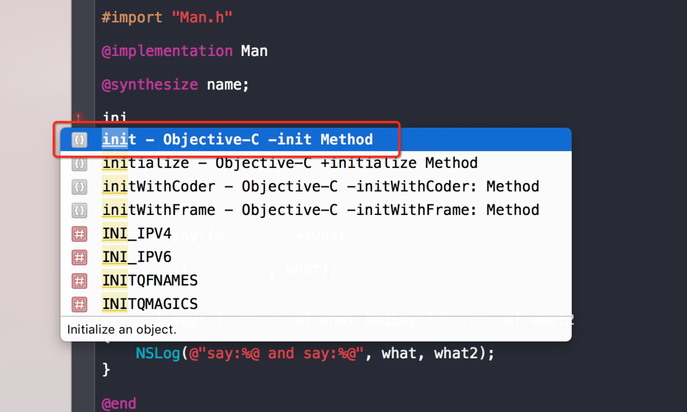<br><br>

点击回车，可以看到Xcode为我们自动补全为以下内容：
``` objc
- (instancetype)init
{
    self = [super init];
    if (self) {
        <#statements#>
    }
    return self;
}
```
我们再看看之前创建man实例的代码“[[Man alloc] init]”，其实就是调用了默认的构造函数，下面我们创建一个新的构造函数。
``` objc
- (instancetype)initWithName: (NSString*) _name
{
    self = [super init];
    if (self) {
        self.name = _name;
    }
    return self;
}
```
我们创建好上面的代码，并在.h文件中进行声明，就可以通过“initWithName:”方法进行对象的初始化了。
``` objc
Man* man2 = [[Man alloc] initWithName:@"Lily"];
NSLog(@"%@", man2.name);
```
## OC中的“接口”
在OC中“接口”的名称叫做protocol，也就是协议，和其他语言一样，它不需要有具体的实现。下面，我们来新建一个头文件，来创建一个OC的“接口”。<br><br>

首先还是和创建类一样，选择“New File”，然后选择头文件。<br>
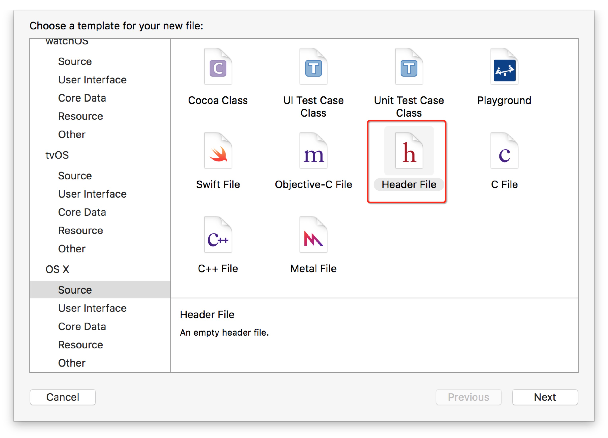<br><br>

接下来，我们保存文件为IWalkable。<br>
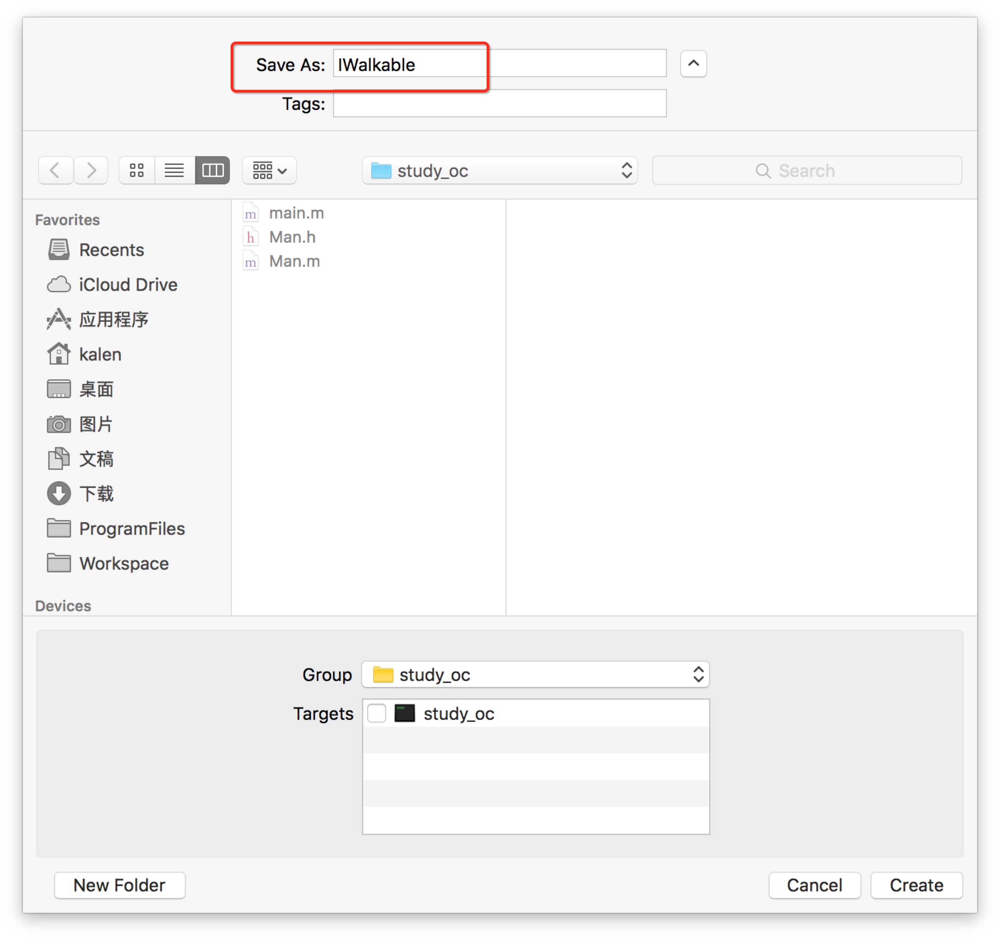<br><br>

我们删除掉系统自动生成的代码，创建协议的代码如下：
``` objc
#import <Foundation/Foundation.h>

@protocol IWalkable

- (void) walk;

@end
```
这里定义了一个walk的方法，实现IWalkable协议的类都需要实现walk这个方法。下面我们在Man.h中引入"IWalkable.h"并让Man实现IWalkable协议。
``` objc
#import <Foundation/Foundation.h>
#import "IWalkable.h"

@interface Man : NSObject<IWalkable>

@property NSString* name;

- (void)walk;

@end
```
实现了协议之后，我们就可以把实例赋值给接口，实现多态了。
``` objc
Man* man2 = [[Man alloc] initWithName:@"Lily"];
NSLog(@"%@", man2.name);

id<IWalkable> walkable = man2;
[walkable walk];
```
## 链接
- [目录](directory.md)  
- 上一节：[移动开发——iOS](4.0.md)  
- 下一节：[基本控件使用](4.2.md)
