# 蓝牙4.0简单介绍

## 蓝牙如何使用
拿到蓝牙模块，一般都会看到4-6个引脚，如下图(6个引脚)： 
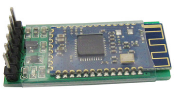  

它的原理图如下： 
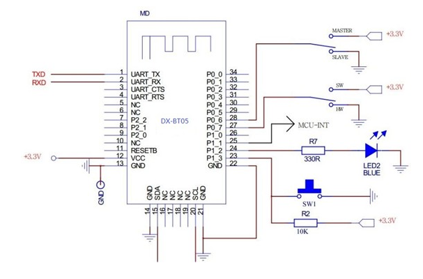  

蓝牙模块一般都是当做串口来用，不管厂家给我们多少个引脚(4个 or 6个)，我们其实只需要用4个，两个是电源(VCC,GND)，两个是通信端口(RXD,TXD)。  

所以，只要给蓝牙模块连接上电源，将蓝牙的RXD连接到arduino的TXD上，当arduino发送数据的时候，蓝牙模块就会把arduino的数据发送给与蓝牙模块配对的其他设备(如手机)。同理，蓝牙的TXD连接到arduino的RXD上，当与蓝牙模块配对的设备发送数据时，蓝牙模块就会把信息传输给arduino单片机了。  

我们的这一节的目的是开发一款安卓和iOS的APP，显示蓝牙配对的界面，以及显示三个滚动条，像上一小节的上位机一样，用来控制RGB小灯的颜色。

## 测试我们的蓝牙
接下来，我们来测试一下蓝牙的好坏，这里一般是将蓝牙的RXD和TXD短接，然后接上电源。 
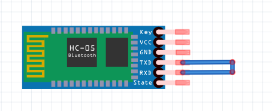  

当我们将蓝牙模块接上电源之后，就可以看到一个小灯一会儿亮一会儿灭了，当蓝牙处于这个状态的时候，说明它还没有配对。  

接下来我们用安卓设备连接蓝牙来看一下小灯的反应，这里使用我们下一节将要学习的APP来测试，读者需要将本章节资源(resource/6.3/BLECom.apk)目录下的安装包安装到自己的安卓手机(必须是支持蓝牙4.0的安卓设备，需要安卓版本大于4.3)。  

打开APP之后，我们就可以看到，已经搜索出了蓝牙设备，我这里名字蓝牙的名字叫："CC41-A"，是默认的名字。 
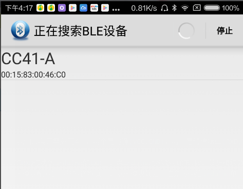  

当我们点击"CC41-A"这个设备时候，就会进入以下界面， 
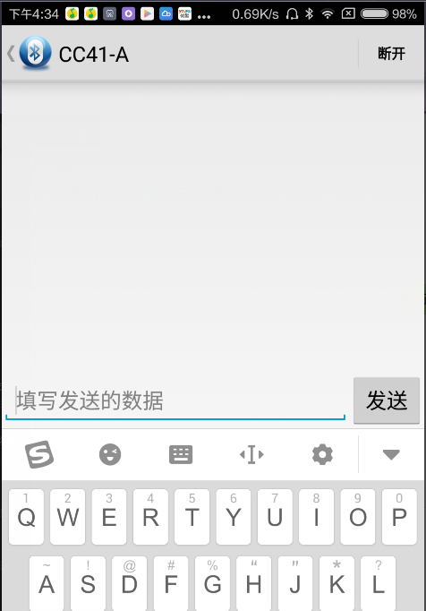  

同时，我们可以看到，蓝牙模块上的小灯从以前的一名一暗，变成了一只亮着，就说明已经配对成功了。 

接下来，我们测试一下接收与发送数据，在EditText控件中输入"Hello, World!"，点击发送，由于RXD和TXD短接，我们发送什么，就会收到什么。 
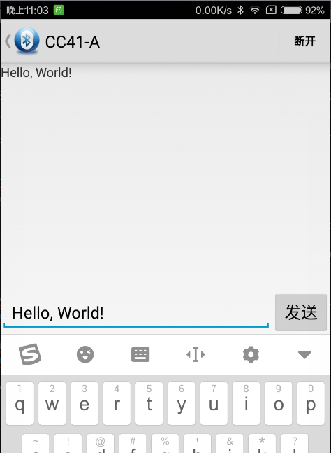  

## AT命令介绍
AT命令可以理解成我们控制硬件设备的一种命令集，我们可以通过AT命令来对终端进行控制。比如说我们可以通过AT命令给蓝牙4.0模块修改名称，波特率等；可以用AT命令让wifi模块联网、发送tcp请求；可以通过AT命令让GSM模块发送短信，发送HTTP请求。。。等等。。。  

我们要使用AT命令，需要通过电脑给蓝牙4.0模块发送控制命令，这需要USB转TTL模块，我们将USB转TTl模块与蓝牙模块相连接(VCC接VCC，GND接GND，RXD接TXD，TXD接RXD)。 
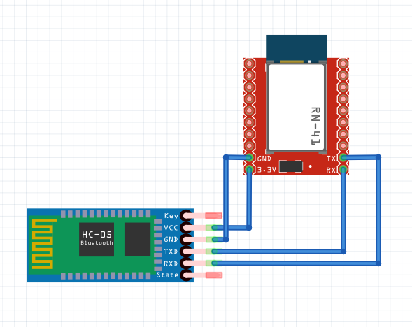  

把USB转TTL模块接入电脑， 
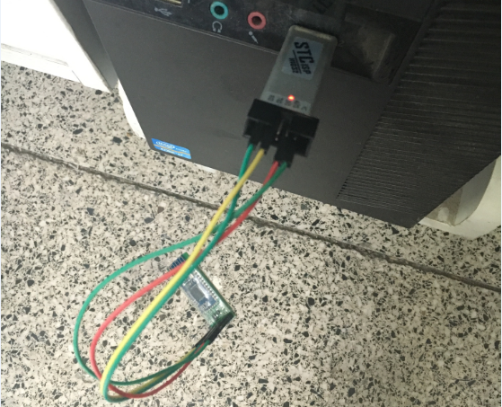  

打开设备管理器，查看端口， 
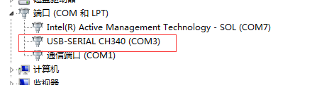  

打开串口工具，因为AT命令需要在结尾发送回车换行符("\r\n")，我们需要使用另一款串口助手(见resource\6.3\sscom32.exe)，并且我们打开CC2541的AT指令集(resource\6.3\BLE-CC41-A_AT Command.pdf)。  

在本小结，我们只需要测试两个命令一个是测试BLE是否连接，第二个是修改蓝牙的名字。 
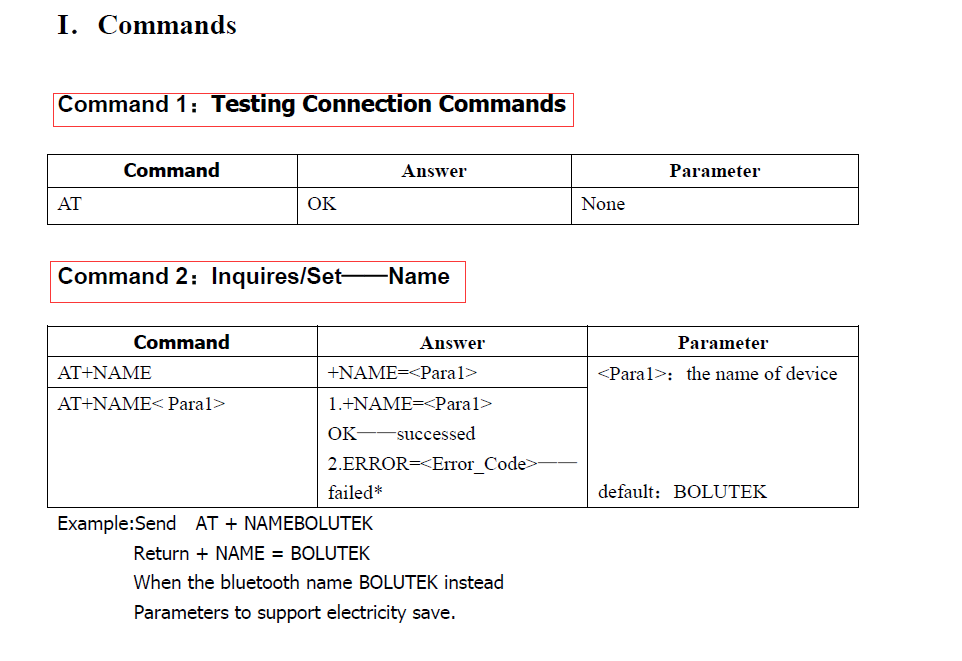  

打开sscom32.exe后，我们先选择COM口，并打开，然后勾选发送新行，在发送区输入“AT”。 
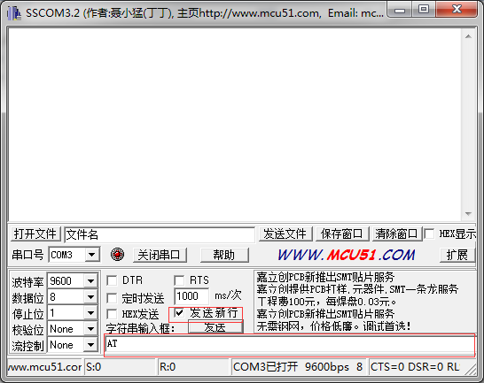  

点击发送之后，我们可以看到接收区显示了“OK”，说明连接正常。 
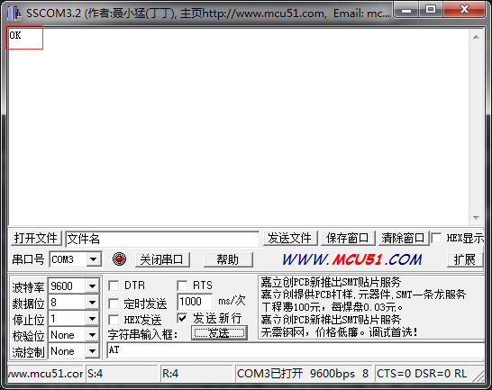  

接下来我们来获取，以及修改蓝牙设备的名字，根据指令集，输入“AT+NAME”，我们可以看到名字和我们之前在安卓手机上搜索的是一样的，“CC41-A”。 
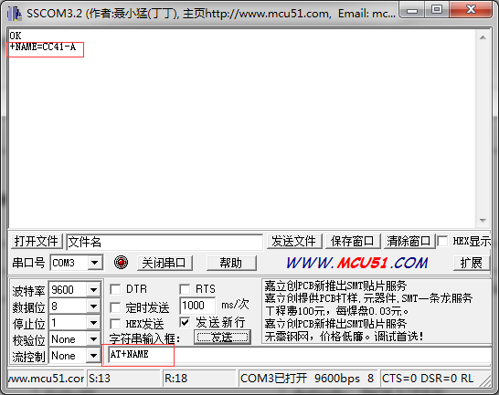  

接下来，我们把蓝牙设备的名字设置为“BLE_RGB_LED”，输入“AT+NAMEBLE_RGB_LED”，可以看到设置名字成功。 
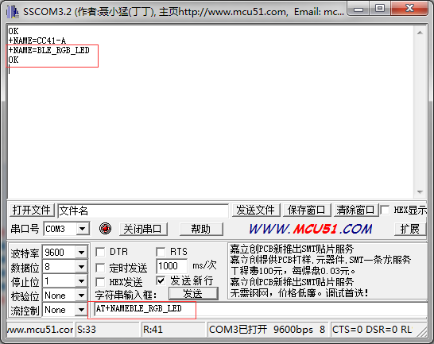  

此时，重启一下蓝牙设备(插拔一下VCC引脚即可)，再在安卓手机上搜索一下，可以看到名字已经改变了。 
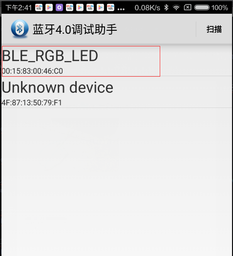  

## 蓝牙4.0协议简单介绍
蓝牙4.0协议非常的复杂(如下)，笔者也没有研究过，只是简单地使用，在单片机端，我们只要把单片机当串口用就好了(默认波特率为9600)。在移动端，我们需要了解API如何调用就可以，在蓝牙4.0中，GATT层是负责和上层应用打交道的，所以我们只需要了解一下GATT就好了。 
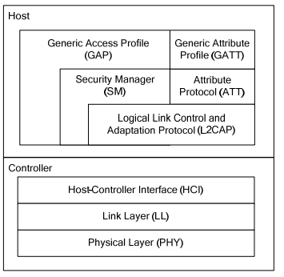  

我们使用蓝牙最主要的目的就是传输数据，GATT(Generic Attribute Profile)就是负责传输数据的，它里面一个Profile中有多个Service，一个Service中有多个Characteristic，一个Characteristic中包括一个value和多个Descriptor。 
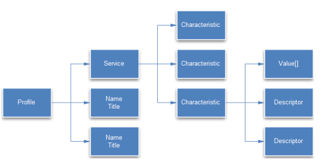  

这里每个服务(Service)或者特性值(Characteristic)都是由一个UUID唯一标示的。在cc2541中，UUID为0000ffe0-0000-1000-8000-00805f9b34fb的Service中UUID为0000ffe1-0000-1000-8000-00805f9b34fb的Characteristic，是负责读写数据的。  

所以我们想要通过手机连接蓝牙，来和单片机通信的话，需要找到这个Characteristic，并调用Characteristic的读写数据的API来和单片机通信。  

我们通过这个服务中uuid为0xffe1的特征值进行读写。读写的数据存在该特征值的value中。  

我们将在下节来看看如何在安卓扫描BLE设备，如何连接BLE设备，如何获取连接的BLE设备的服务与特征值，以及对他们进行读写。

## 链接
- [目录](directory.md)  
- 上一节：[用上位机控制RGB灯颜色](6.2.md)  
- 下一节：[蓝牙4.0安卓例程源码阅读](6.4.md)
