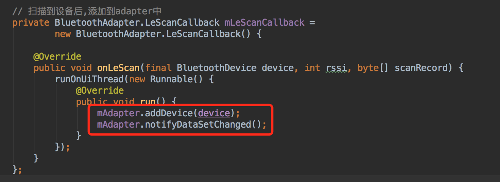
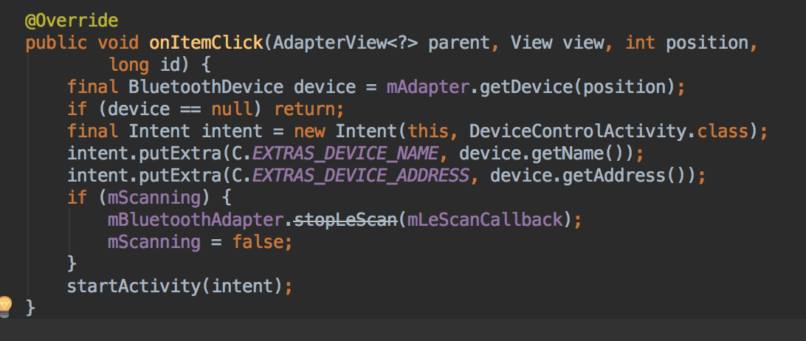
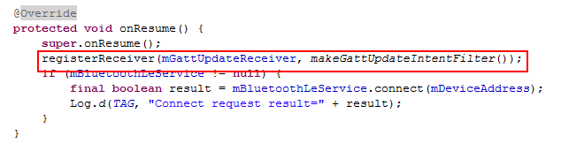
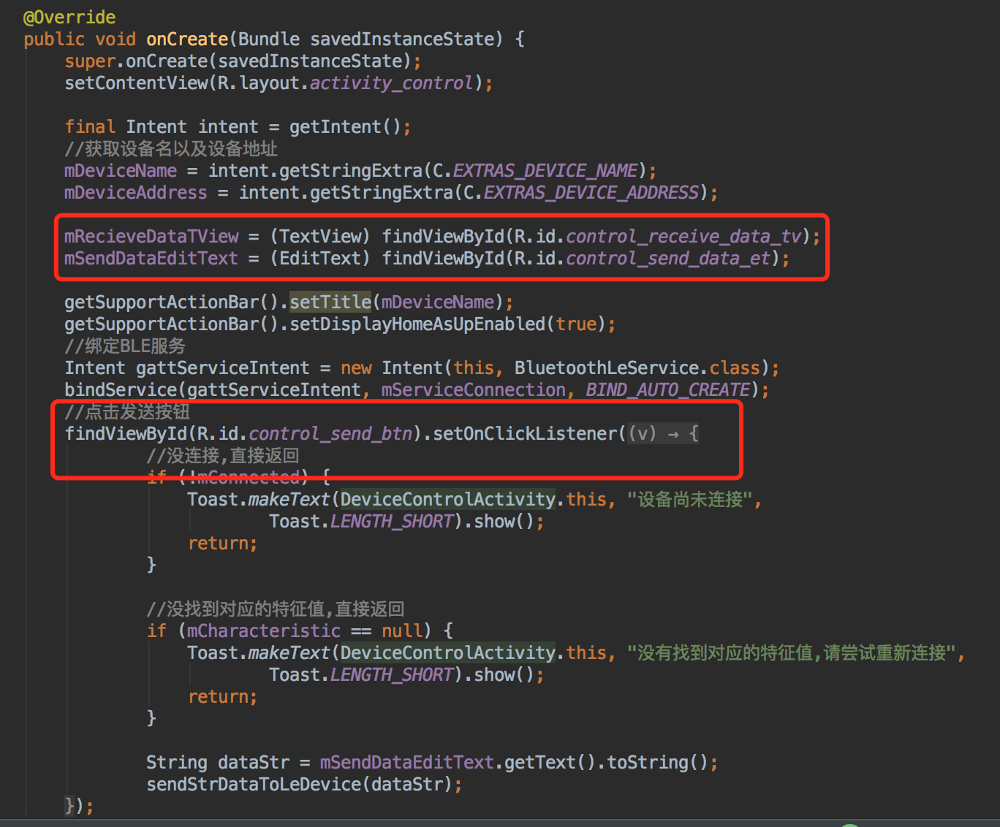
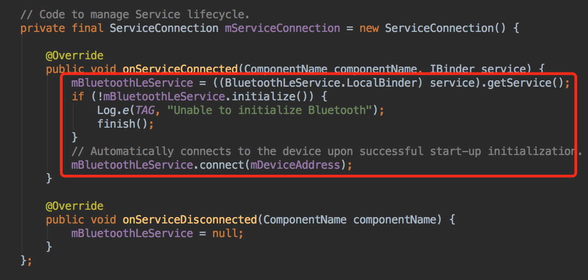
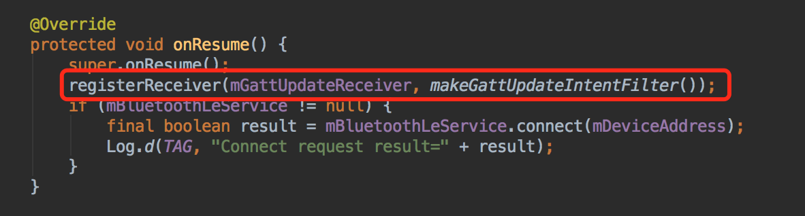
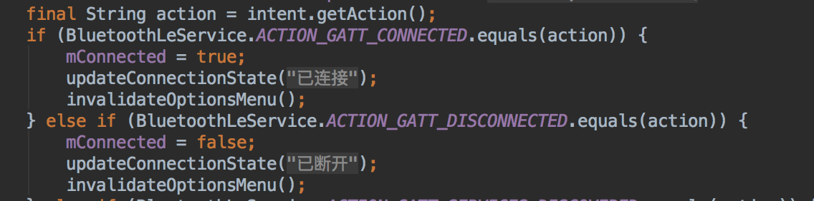
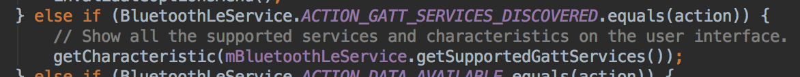
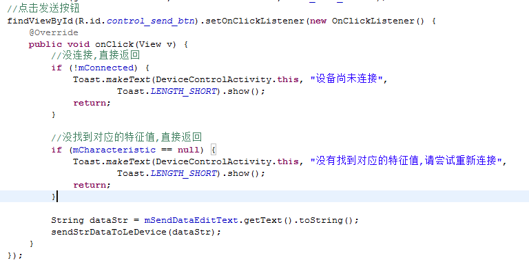
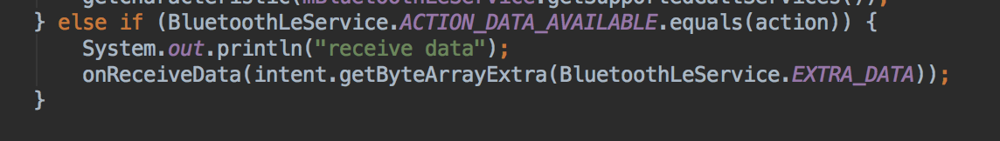

# 蓝牙4.0安卓例程源码阅读

## 代码结构
首先我们导入本章节的代码到eclipse中，看一下代码的结构。 
  

## AndroidManifest.xml
看完了项目结构后，我们打开manifest文件，可以看到这里包含了一些权限，以及两个Activity和一个Service。 
  

可以看到这里需要蓝牙的控制权限，并且要求手机支持蓝牙4.0，模拟器无法使用蓝牙4.0，所以必须在真机下进行测试，关于如何进行真机测试可以查阅百度或查看[附录B](appendixB)的内容。  

除此之外，我们的最小sdk要求版本是18，也就是安卓4.3，你需要确保你的手机操作系统在安卓4.3版本以上。  

接下来，我们可以看到DeviceScanActivity是应用程序的入口，也就是扫描设备的Activity；DeviceControlActivity，控制发送接收蓝牙数据的Activity；以及BluetoothLeService，用于接收蓝牙数据的Service。  

我们将要在下面仔细研究两个Activity的代码，BluetoothLeService的代码读者有兴趣可以自己查看。

## DeviceScanActivity分析
### 布局文件分析
我们首先看一下onCreate方法中的setContentView设置的layout文件，这里设置到了activity_scan.xml。我们打开之后，发现activity_scan.xml里面只有一个ListView，也就是展示出所有的扫描到的蓝牙设备。 
  

下面，我们将围绕着如何获取可配对的蓝牙设备列表，以及它的点击事件来展开。

### 扫描蓝牙设备
我们继续看onCreate方法，这里首先创建一个Handler，这是安卓中用来处理异步消息的，我们之前没有讲过它，因为我们的安卓程序不涉及到网络请求，所以我也就没有提及，读者如果不知道Handler，可以先不用管它。  

接下来，在onCreate方法判断了是否支持蓝牙，并获取了蓝牙适配器，我们可以通过手机的蓝牙适配器来获取周围的蓝牙设备。  

看完了onCreate之后，我们开始看onResume方法，这里初始化了ListView，以及调用了一个叫scanLeDevice的方法，看这里名字，我们可以确定这是扫描蓝牙设备的函数，是关注的重点。  

进入scanLeDevice之后，我们可以看到这里使用了Handler.postDelayed方法，并传了一个Runnable对象以及Delay的时间SCAN_PERIOD，这条语句将在SCAN_PERIOD后，也就是10秒钟后执行Runnable对象的run方法。  

在run方法中，这里调用了蓝牙适配器的stopLeScan方法，也就是10秒钟后停止扫描，而在handler之后则调用了startLeScan方法，也就是说，在调用scanLeDevice(true)后，将会开始扫描蓝牙设备，并且在10秒后会停止扫描。 
  

但是这里面还有一个变量我们不清楚，就是mLeScanCallback这个变量，我们可以在代码的最后面找到它，这个变量中叫做LeScanCallBack，也就是Ble设备扫描时候的回调，当扫描到蓝牙设备后，就会调用onLeScan方法，并把蓝牙设备的信息拿到。 
  

我们可以看到在onLeScan中我们把蓝牙设备添加到ListView的adapter中了，至此我们也就知道如何扫描的设备了。这里添加设备是在一个runOnUiThread的方法中添加的，读者有兴趣可以自己查阅，进行更深的理解。

### ListView点击事件
在onResume中，listview调用了setOnItemClickListener，并把它设置为了this对象，所以我们可以看到DeviceScanActivity实现了OnItemClickListener接口，我们可以在DeviceScanActivity的onItemClick方法中找到点击事件的结果。 
  

这里的代码很简单，首先获取蓝牙设备(BluetoothDevice)，然后启动DeviceControlActivity，并把蓝牙设备的名称和地址传给DeviceControlActivity。

## DeviceControlActivity分析
### 布局分析
进入到DeviceControlActivity.java，我们和看DeviceScanActivity一样先看onCreate方法中设置的布局文件：activity_control.xml，这里定义了一个发送区、接收区、以及发送的按钮。 
  

我们回到onCreate方法，可以看到这里通过findViewById获取相应的控件，并且给按钮设置了点击事件onClickListener。 
  

这里点击按钮的onClick事件比较长，我们先跳过。

### 绑定Service
在onCreate方法中，还调用了bindService方法，我们可以找到到绑定的ServiceConnection。 
  

在ServiceConnection对象的onServiceConnected方法中，通过Binder对象获取到了Service实例，并通过Service实例的connect方法，与蓝牙进行连接(配对)。这里我们不会仔细讲解connect方法的实现，只需要把它当成一个黑匣子就行。

### 蓝牙广播事件
看到这里，我们就应该有一个疑问，既然调用了连接方法，那么什么时候连接成功，什么时候连接断开了呢？这里面应该有一个回调函数来实时获取他的状态。我们带着这个疑问，来看看onResume方法。  

在onResume方法中，我们可以看到这里注册了一个广播，广播的IntentFilter是通过makeGattUpdateIntentFilter获得的。 
  

我们接下来先看看makeGattUpdateIntentFilter，这里注册了ACTION_DATA_AVAILABLE，ACTION_GATT_CONNECTED，ACTION_GATT_DISCONNECTED以及ACTION_GATT_SERVICES_DISCOVERED四个Action。看到这里我们之前的疑问应该得到解答了，连接事件、断开事件等都是通过广播接受者来获取的。下面我们进入mGattUpdateReceiver中，看看这四个Action对应的处理。

#### ACTION_GATT_CONNECTED和ACTION_GATT_DISCONNECTED
ACTION_GATT_CONNECTED和ACTION_GATT_DISCONNECTED对应着蓝牙连接与蓝牙断开。处理这两个Action的时候，调用了updateConnectionState和invalidateOptionsMenu两个方法。 
  

这里很简单，就是更新连接状态并且刷新菜单。

#### ACTION_GATT_SERVICES_DISCOVERED
ACTION_GATT_SERVICES_DISCOVERED对应着发现服务，在上一节谈到，一个GATT Profile有多个服务(Service)，一个服务有多个特征值(Characteristic)。而在CC2541中，我们通过uuid为0xffe0的服务中uuid为0xffe1的特征值来进行读写。而在处理ACTION_GATT_SERVICES_DISCOVERED的时候，我们可以通过BluetoothLeService来获取到所有的服务。 
  

在getCharacteristic方法中，我们会遍历service找到uuid为0xffe0的service，并从其中找到uuid为0xffe1的characteristic。 
  

#### ACTION_DATA_AVAILABLE
ACTION_DATA_AVAILABLE对应着有数据传送过来，这里直接通过intent来获取数据。 
  

在onReceiveData方法中，把接收到的字符数据显示在TextView中。 
  

### 发送数据
看完了广播接受者处理的事件之后，我们可以继续看看onClick方法中的内容了。 
  

这里首先判断了我们的蓝牙是否连接；接着判断了我们是否找到了uuid为0xffe1的特征值；最后通过sendStrDataToLeDevice把数据发送出去。  

在sendStrDataToLeDevice方法中，首先把string转换为byte数组，然后byte数组设置到特征值上，把它write出去就发送成功。 
  

至此，我们对于BLE例程源码的解读就算完成了。

## 链接
- [目录](directory.md)  
- 上一节：[蓝牙4.0简单介绍](6.3.md)  
- 下一节：[用安卓手机控制RGB灯颜色](6.5.md)
