# 用安卓手机控制RGB灯颜色

## SeekBar控件的使用
为了实现和5.2节相类似的安卓app，我们首先先来再学习一个控件：SeekBar。首先创建一个名为SeekBarTest的工程。<br><br>

接下来，我们修改activity_main.xml，如下:
``` xml
<?xml version="1.0" encoding="utf-8"?>
<LinearLayout xmlns:android="http://schemas.android.com/apk/res/android"
    android:layout_width="match_parent"
    android:layout_height="match_parent"
    android:orientation="vertical">

    <TextView
        android:id="@+id/seekbar_value"
        android:layout_width="match_parent"
        android:layout_height="wrap_content"
        android:gravity="center"
        android:text="0" />

    <SeekBar
        android:max="50"
        android:id="@+id/seekbar"
        android:layout_width="match_parent"
        android:layout_height="wrap_content"/>

</LinearLayout>
```
这里使用了SeekBar控件，并把它最大值设为50，也就是它的范围是0-50；并使用一个TextView来显示SeekBar的位置。<br><br>

接着，我们像之前一样，通过findViewById找到相应的View。
``` java
package kalen.app.example.seekbartest;

import android.support.v7.app.AppCompatActivity;
import android.os.Bundle;
import android.widget.SeekBar;
import android.widget.TextView;

public class MainActivity extends AppCompatActivity {
    TextView textView;
    SeekBar seekBar;

    @Override
    protected void onCreate(Bundle savedInstanceState) {
        super.onCreate(savedInstanceState);
        setContentView(R.layout.activity_main);
        textView = (TextView) findViewById(R.id.seekbar_value);
        seekBar = (SeekBar) findViewById(R.id.seekbar);
    }
}
```
和button和listview类似，seekBar有一个事件监听器叫setOnSeekBarChangeListener，很显然这是监控seekBar的值变化的。在OnSeekBarChangeListener接口中，有三个方法onProgressChanged，onStartTrackingTouch，onStopTrackingTouch，分别对应着：seekBar的进度改变，开始拖动seekBar，结束拖动seekBar。我们这里只需要在onProgressChanged方法中添加代码就好了。
``` java
seekBar.setOnSeekBarChangeListener(new SeekBar.OnSeekBarChangeListener() {
   @Override
   public void onProgressChanged(SeekBar seekBar, int i, boolean b) {
       //设置textView显示根据seekBar的位置
       textView.setText(i + "");
   }

   @Override
   public void onStartTrackingTouch(SeekBar seekBar) {

   }

   @Override
   public void onStopTrackingTouch(SeekBar seekBar) {

   }
});
```
这里给textView设置了文本，运行程序后，拖动seekBar，我们就可以看到textView显示的进度了。<br>
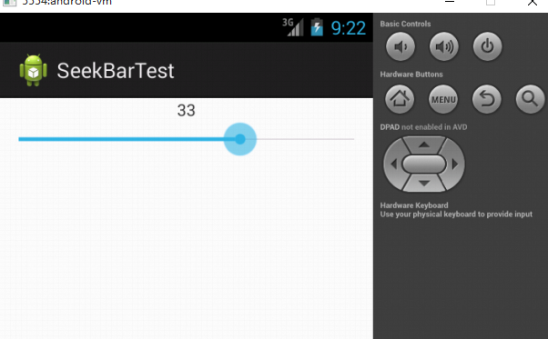<br><br>

## RGB控制安卓APP编写
学习了SeekBar控件后，我们开始利用BLECom这个例程来编写我们自己的小灯控制上位机。

### 创建例程副本
首先，为了代码分离，我们先拷贝一下BLECom这个文件夹，并把文件夹起名为：BleRGBController。<br>
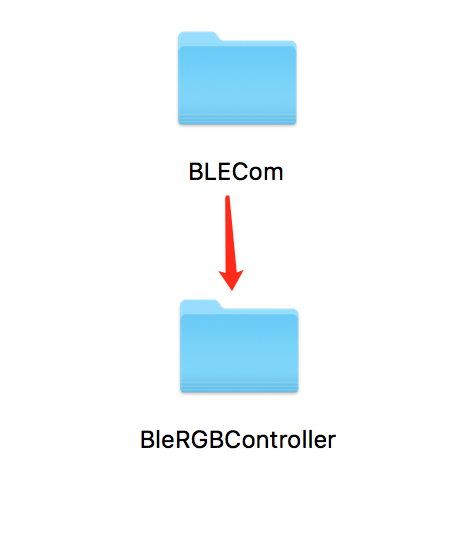<br><br>

然后我们打开Android Studio选择Open an Existing Android Studio Project。<br>
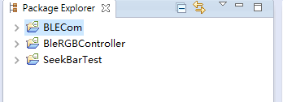<br><br>

然后打开BleRGBController即可。<br>
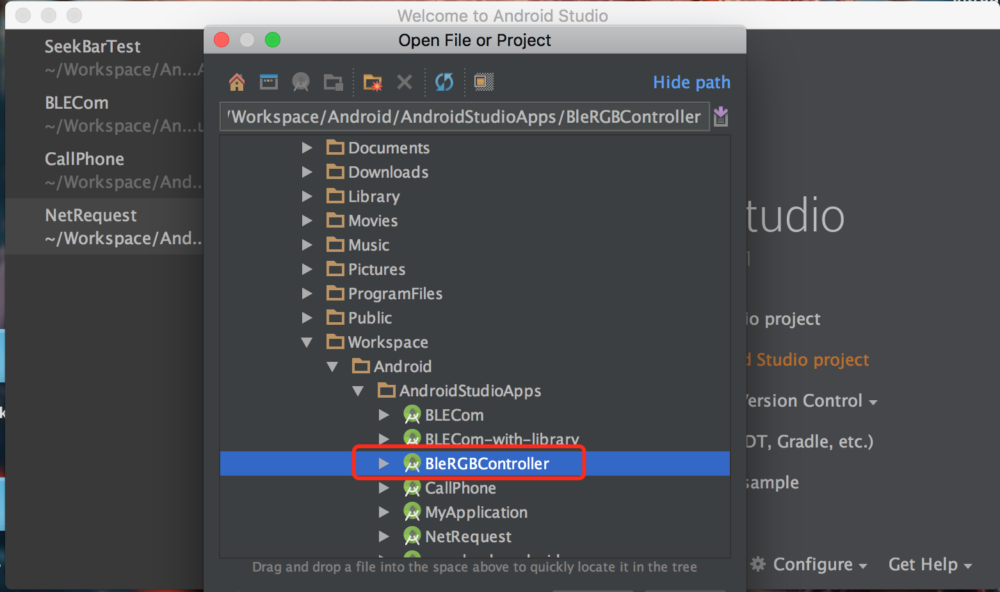<br><br>

### 修改应用包名
此时，我们虽然复制了一份，工程名字和之前不同，但是如果安装的话，还是同一个APP。我们打开manifest文件，可以看到应用的包名还是没有变化。<br>
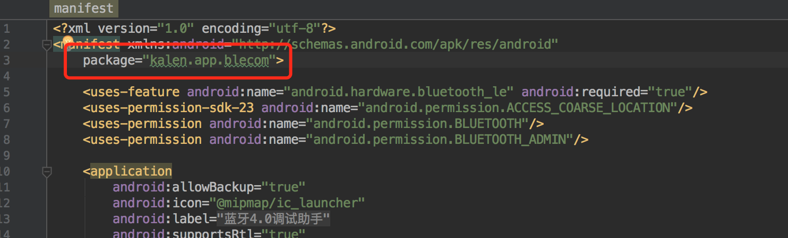<br><br>

下面，我们右键包名，选择`Refactor`，选择`Rename`。<br>
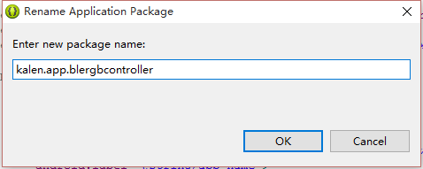<br><br>

这时候会给我警告，我们选择`Rename package`。<br>
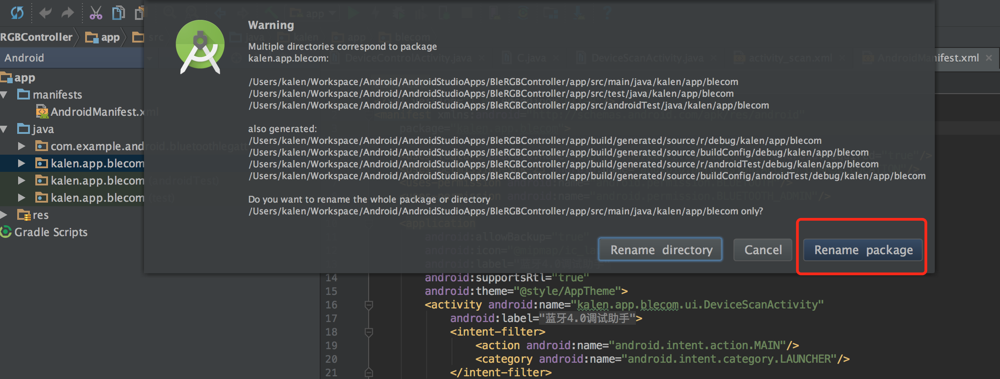<br><br>

这时候我们发现可以修改包名的最后一个路径，我这里把blecom改成blergbcontroller。<br>
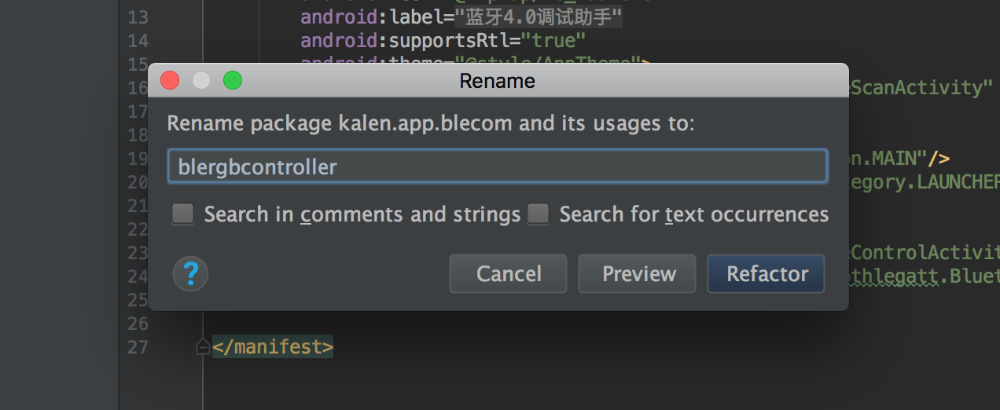<br><br>

当然如果想要修改其他位置，比如说把kalen改成nladuo。可以点击左栏右上角的设置按钮，把`Compact Empty Middle Packages`勾选掉。<br>
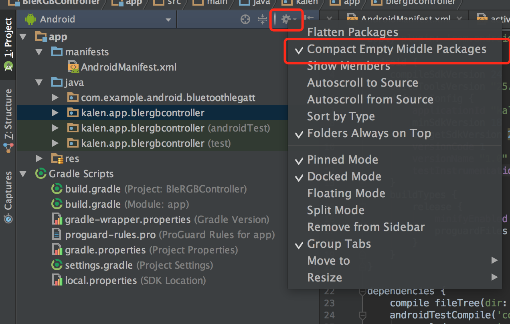<br><br>

这时候，中间的文件夹就显示出来了，可以指定任何一个文件夹进行修改。<br>
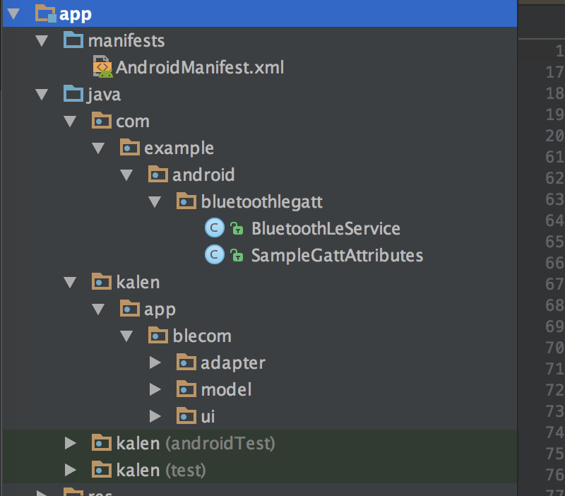<br><br>


点击`Refactor`后，下方会把相关的文件都显示出来。<br>
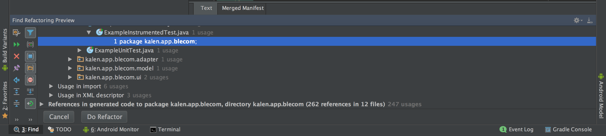<br><br>

我们点击`Do Refactor`之后，可以看到和blecom相关的，都变成blergbcontroller了。<br>
<br><br>

接下来，我们还要修改一下gradle文件，选择Module:app的build.gradle，修改里面的applicationId。<br>
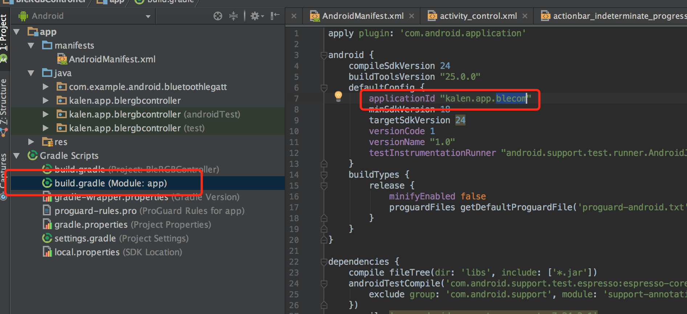<br><br>

最后，我们点击`Sync Now`，同步一下。<br>
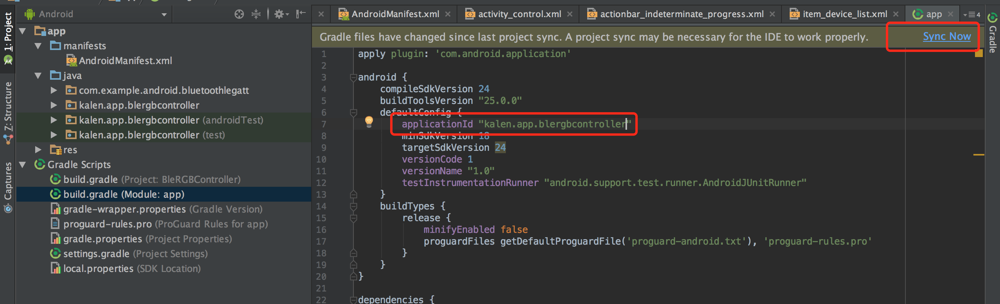<br><br>


除此之外，就是在res文件夹下修改一下App的名字，App的图标，这里就不赘述了。
### 修改界面
接下来，我们开始修改界面，把activity_control.xml的布局全都删掉，改为以下的布局：
``` xml
<?xml version="1.0" encoding="utf-8"?>
<LinearLayout xmlns:android="http://schemas.android.com/apk/res/android"
        android:orientation="vertical"
        android:layout_width="match_parent"
        android:layout_height="match_parent">

    <TextView
        android:layout_marginTop="40dp"
        android:id="@+id/seekbar_value_r"
        android:layout_width="match_parent"
        android:layout_height="wrap_content"
        android:gravity="center" />
    <SeekBar
        android:layout_width="match_parent"
        android:layout_height="wrap_content"
        android:id="@+id/seekbar_r"
        android:max="49"/>

    <TextView
        android:layout_marginTop="40dp"
        android:id="@+id/seekbar_value_g"
        android:layout_width="match_parent"
        android:layout_height="wrap_content"
        android:gravity="center" />
    <SeekBar
        android:layout_width="match_parent"
        android:layout_height="wrap_content"
        android:id="@+id/seekbar_g"
        android:max="49"/>

    <TextView
        android:layout_marginTop="40dp"
        android:id="@+id/seekbar_value_b"
        android:layout_width="match_parent"
        android:layout_height="wrap_content"
        android:gravity="center" />
    <SeekBar
        android:layout_width="match_parent"
        android:layout_height="wrap_content"
        android:id="@+id/seekbar_b"
        android:max="49"/>

</LinearLayout>
```
这里设置了三个TextView和三个SeekBar，分别对应R、G、B。

### 修改代码
修改完布局后，代码出现了一些错误，我们把所有和之前的TextView、EditText以及Button的代码都删除掉。并添加三个TextView与SeekBar，并让DeviceControlActivity实现OnSeekBarChangeListener接口。
``` java
private TextView seekBarValueR;
private TextView seekBarValueG;
private TextView seekBarValueB;
private SeekBar seekBarR;
private SeekBar seekBarG;
private SeekBar seekBarB;
@Override
public void onCreate(Bundle savedInstanceState) {
    super.onCreate(savedInstanceState);
    setContentView(R.layout.activity_control);

    //此处省略其他配置。。。。。

    seekBarValueR = (TextView) findViewById(R.id.seekbar_value_r);
    seekBarValueG = (TextView) findViewById(R.id.seekbar_value_g);
    seekBarValueB = (TextView) findViewById(R.id.seekbar_value_b);

    seekBarR =  (SeekBar) findViewById(R.id.seekbar_r);
    seekBarG =  (SeekBar) findViewById(R.id.seekbar_g);
    seekBarB =  (SeekBar) findViewById(R.id.seekbar_b);

    seekBarR.setOnSeekBarChangeListener(this);
    seekBarG.setOnSeekBarChangeListener(this);
    seekBarB.setOnSeekBarChangeListener(this);
}
```
在seekBar滑动的时候，我们需要把数据发送给蓝牙。
``` java
@Override
public void onProgressChanged(SeekBar seekBar, int progress, boolean fromUser) {
    sendRGBToBle(seekBarR.getProgress(), seekBarG.getProgress(), seekBarB.getProgress());
    seekBarValueR.setText("R:" + seekBarR.getProgress());
    seekBarValueG.setText("G:" + seekBarG.getProgress());
    seekBarValueB.setText("B:" + seekBarB.getProgress());
}

@Override
public void onStartTrackingTouch(SeekBar seekBar) {

}

@Override
public void onStopTrackingTouch(SeekBar seekBar) {

}
```
这里需要编写一个sendRGBToBle的方法，把seekbar的位置发送给蓝牙，类似之前的sendStrDataToLeDevice。
``` java
private void sendRGBToBle(int R, int G, int B){
  	//没连接,直接返回
    if (!mConnected) {
    	Toast.makeText(DeviceControlActivity.this, "设备尚未连接",
    			Toast.LENGTH_SHORT).show();
    	return;
    }

    //没找到对应的特征值,直接返回
    if (mCharacteristic == null) {
    	Toast.makeText(DeviceControlActivity.this, "没有找到对应的特征值,请尝试重新连接",
    			Toast.LENGTH_SHORT).show();
    	return;
    }

    byte[] datas = new byte[]{(byte) R, (byte) (G + 50), (byte) (B + 100)};
    mCharacteristic.setValue(datas);
    mBluetoothLeService.writeCharacteristic(mCharacteristic);
}
```
至此，安卓部分的程序就改写完成了。
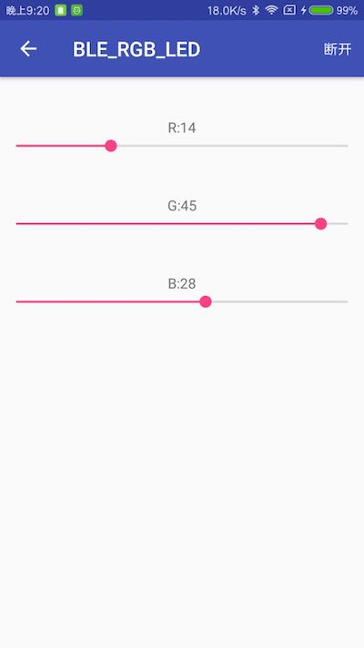<br><br>

## 下载程序
完成了安卓部分代码的开发之后，我们要先把6.1节的程序烧写在arduino单片机中。<br><br>

> 注意：这里不能先连接蓝牙，再下载程序到Arduino。因为arduino通过串口来下载，而蓝牙也是占用串口的，为了避免出现冲突，所以最后再连接蓝牙。


## 电路连接
这次实验我们将使用的是蓝牙串口，而不是默认的USB串口了。所以要把蓝牙、RGB-LED、nano开发板三者都连在一起。<br><br>

RGB-LED和nano开发板的连接我们之前就说过了。这里主要说一下蓝牙和arduino开发板的连接。<br>
我们需要连接三个管脚：<br>
- 蓝牙的VCC：电源，连接到nano开发板的``5V``上面。
- 蓝牙的VCC：电源，连接到nano开发板的``GND``上面。
- 蓝牙的TXD：电源，连接到nano开发板的``RXD``上面，也就是对应的``D0``管脚。

## 测试
完成程序的下载与电路的连接之后，我们可以给单片机供电了。供电之后，我们使用我们的APP发送控制信号给单片机，从而改变颜色试试。<br><br>

以下这个动图就是最后的效果：（可能加载有些慢）<br>

<br><br>


## 链接
- [目录](directory.md)  
- 上一节：[蓝牙4.0安卓例程源码阅读](6.4.md)  
- 下一节：[网络模块案例——温度采集系统开发](7.0.md)
