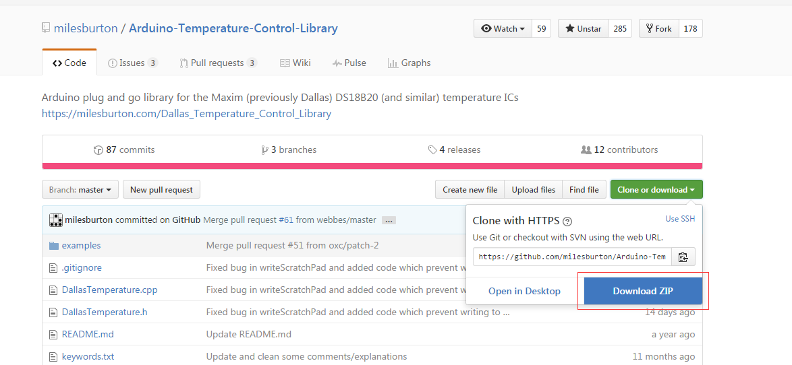
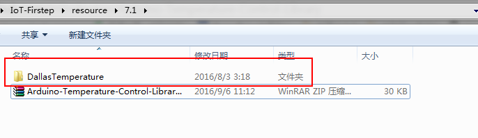
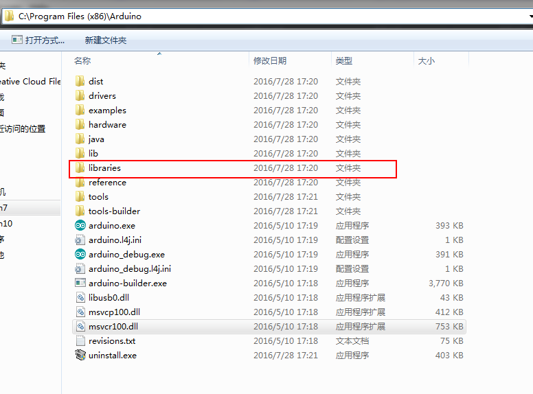
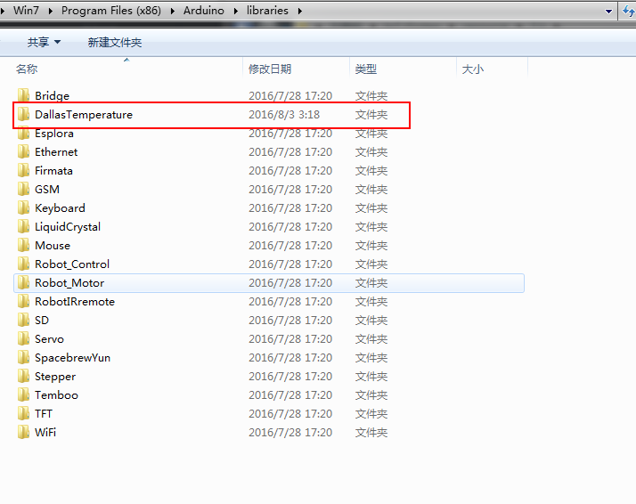
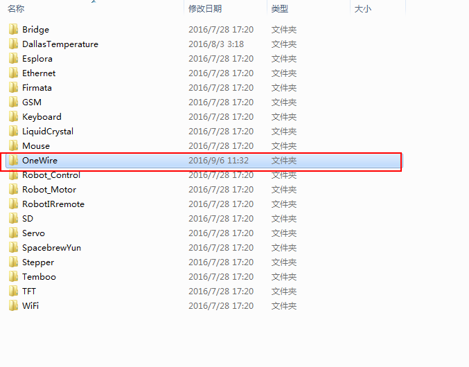
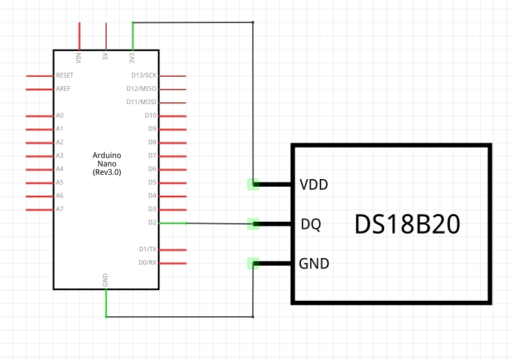
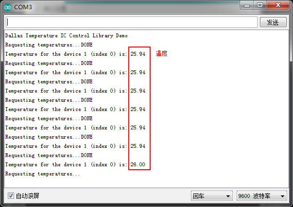

# Arduino温度传感器的使用

## 电路连接

## 导入DS18B20库
DS18B20的读取实现比较复杂，我们这里就不详细介绍了，而是使用github开源的库来实现。我们先来看看如何在Arduino中导入库文件。<br><br>

我们首先进入DS18B20库的github主页: https://github.com/milesburton/Arduino-Temperature-Control-Library ，点击Download Zip下载。<br>
<br><br>

接下来，我们要导入这个库，解压Arduino-Temperature-Control-Library-master.zip，并把文件夹重命名为：DallasTemperature。<br>
<br><br>

然后，我们进入Arduino的安装目录，可以看到有个叫libraries的文件夹，<br>
<br><br>

接下来，我们把DallasTemperature文件夹移动到libraries目录下，就完成库的安装了。<br>
<br><br>

DallasTemperature库依赖于一个叫OneWire的库，这个库的项目主页在https://github.com/PaulStoffregen/OneWire 上，我们重复之前的步骤，把文件夹重命名为OneWire，拷贝到libraries目录下。<br>
<br><br>

## 运行测试
库导好之后，我们开始将DS18B20模块连接到我们的nano开发板上，DS18B20只有三个引脚，电源、地、还有数据线，把开发板的D2口和数据口相连，电源和地接好就行了。<br>
<br><br>

接下来我们烧写DallasTemperature的示例代码，如下：
``` arduino
#include <OneWire.h>
#include <DallasTemperature.h>

// 将DS18B20的数据口连接到2号引脚
#define ONE_WIRE_BUS 2
// 初始连接在单总线上的单总线设备
OneWire oneWire(ONE_WIRE_BUS);
DallasTemperature sensors(&oneWire);

void setup(void)
{
  // 串口设置
  Serial.begin(9600);
  Serial.println("Dallas Temperature IC Control Library Demo");

  // 加载库
  sensors.begin();
}

void loop(void)
{
  Serial.print("Requesting temperatures...");
  sensors.requestTemperatures(); // 获取温度
  Serial.println("DONE");

  Serial.print("Temperature for the device 1 (index 0) is: ");
  Serial.println(sensors.getTempCByIndex(0));  
}
```
这里我们使用串口把读取到的温度显示出来，下面编译、上传程序，打开串口监视器，就可以看到温度了。<br>


## 链接
- [目录](directory.md)  
- 上一节：[网络模块案例——温度采集系统开发](7.0.md)  
- 下一节：[ENC28J60模块的使用](7.2.md)
