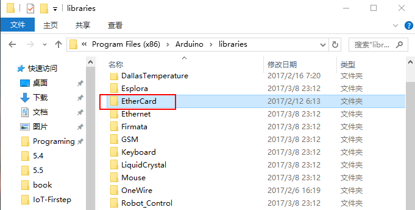
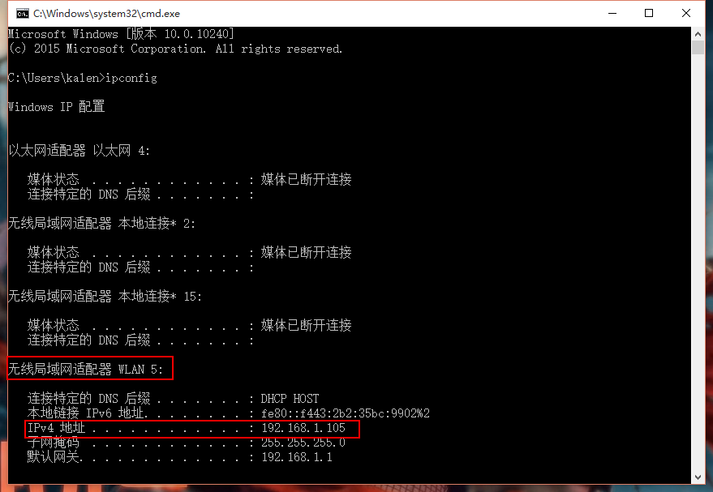
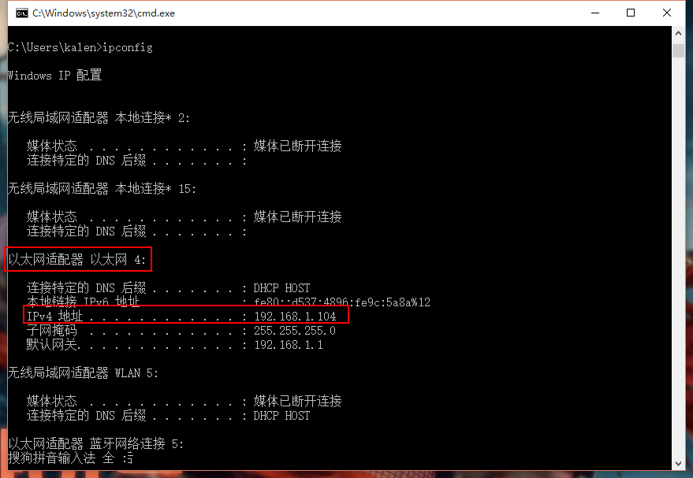
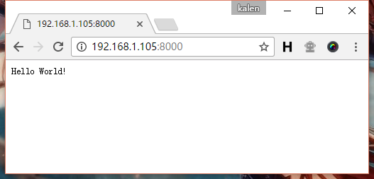
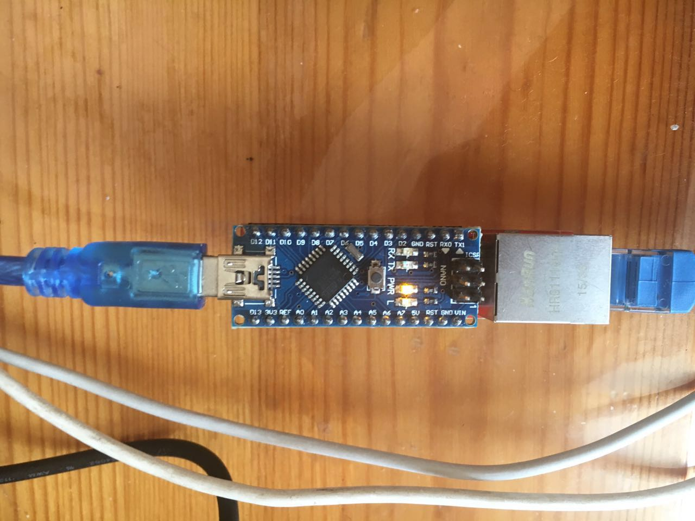
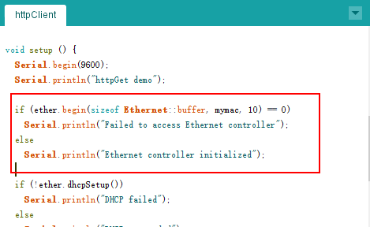
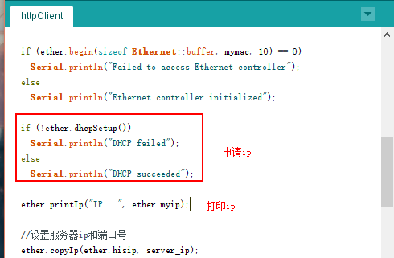
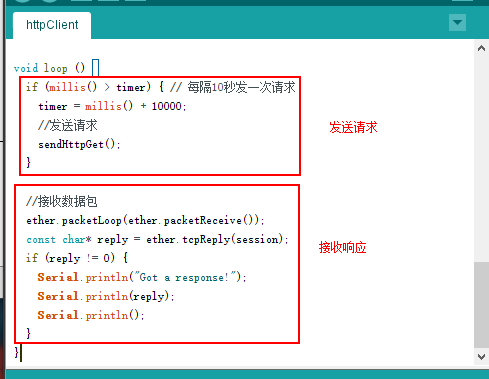
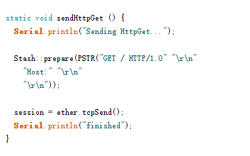

# ENC28J60模块的使用

## 导入ENC28J60库
和上一节一样，我们将使用第三方库来实现以太网模块的功能调用。我们进入ENC28J60库的github主页，https://github.com/jcw/ethercard ，然后点击Download Zip，并把文件夹重命名为“EtherCard”，移动到libraries目录下。<br>
<br><br>

## 发送HTTP请求
### 编写测试服务器
完成了库的导入之后，我们先编写一个测试服务器，用来接受单片机发来的Http请求，这里写一个“Hello World”程序就好了。
``` go
package main

import (
  "github.com/gin-gonic/gin"
)

func main() {
    r := gin.Default()

    r.GET("/", func(c *gin.Context) {
      c.String(200, "Hello World!")
    })

    r.Run(":8000")
}
```
接下来，我们需要获取一下本机的ip地址，因为单片机和电脑的ip是不同的，所以不能像之前一样输入localhost或者127.0.0.1。获取的ip命令可以打开dos，输入`ipconfig`命令获取到。<br>
<br><br>

由于笔者使用的是无限网络，所以ip可以在无线局域网适配器找到，如果连接的是网线，可以在以太网适配器这里找到ip。<br>
<br><br>

笔者的ip是192.168.1.105，运行程序后，在浏览器上输入"192.168.1.105:8000"，查看程序是否正常运行。<br>
<br><br>

### 连接硬件
接下来，我们将nano模块和以太网模块连接到一起，并使用网线连接到路由器上。<br>
<br><br>

注意：这里需要确保电脑和单片机连接的是一台路由器。

### 使用单片机发送http请求
#### 案例解释
接下来，看一下我根据官方example修改的http请求的例子。
``` cpp
#include <EtherCard.h>

// ethernet interface mac address, must be unique on the LAN
static byte mymac[] = { 0x74,0x69,0x69,0x2D,0x30,0x31 };

static uint8_t server_ip[] = { 192, 168, 1, 105 };
byte Ethernet::buffer[700];
static byte session = 1;
static uint32_t timer;

static void sendHttpGet () {
  Serial.println("Sending HttpGet...");

  Stash::prepare(PSTR("GET / HTTP/1.0" "\r\n"
    "Host:" "\r\n"
    "\r\n"));

  session = ether.tcpSend();
  Serial.println("finished");  
}

void setup () {
  Serial.begin(9600);
  Serial.println("httpGet demo");

  if (ether.begin(sizeof Ethernet::buffer, mymac, 10) == 0)
    Serial.println("Failed to access Ethernet controller");
  else
    Serial.println("Ethernet controller initialized");

  if (!ether.dhcpSetup())
    Serial.println("DHCP failed");
  else
    Serial.println("DHCP succeeded");

  ether.printIp("IP:  ", ether.myip);
  ether.printIp("GW:  ", ether.gwip);  
  ether.printIp("DNS: ", ether.dnsip);  

  //设置服务器ip和端口号
  ether.copyIp(ether.hisip, server_ip);
  ether.hisport = 8000;
}

void loop () {
  if (millis() > timer) { // 每隔10秒发一次请求
    timer = millis() + 10000;
    //发送请求
    sendHttpGet();
  }

  //接受数据包
  ether.packetLoop(ether.packetReceive());
  const char* reply = ether.tcpReply(session);
  if (reply != 0) {
    Serial.println("Got a response!");
    Serial.println(reply);
    Serial.println();
  }
}
```
我们从，setup函数开始看起，这里首先是初始化以太网的mac地址，mac地址只要是唯一的，并且第一位是偶数就可以，我们使用example里面的就好了。<br>
<br><br>

接下来，为了让我们的以太网模块连接到路由器，需要获取一个ip，这里我们选用DHCP，动态申请一个ip地址，然后将它打印出来。<br>
<br><br>

最后，设置一下要连接的服务器的ip和端口号就完成了初始化操作。<br>
<br><br>

下面看看loop函数里面的东西，这里分为"发送请求"和"接受响应"两个部分。<br>
<br><br>

这里我们每10秒钟调用一次sendHttpGet，其他的时间都在回调检查是否有新的数据包，如果数据包的长度不为0，就说明有数据传来，这里将数据直接打印出来。因为网络有阻塞，所以要通过一个id(也就是session变量)来记录一次请求的id，然后再在循环里面通过这个id找到对应的reply。<br><br>

最后再来看看sendHttpGet函数。<br>
<br><br>

像在5.4节使用telnet客户端一样，这里使用了HTTP1.0协议请求服务器的"/"的资源，并把请求的id记录在session变量中。

#### 运行结果
最后，我们上传代码，打开串口监视器查看一下结果。<br>
<br><br>

这里可以看到我们在reply里面拿到了正确的返回结果。（另外，这里可以看到发送了两次请求，但是却只返回了一个响应，笔者发现第一次请求都是不成功的，暂时不知道是什么bug，不过网络上出现阻塞、或者其他问题也是很正常的，这个并不影响我们的使用）

## 链接
- [目录](directory.md)  
- 上一节：[iOS——用手机控制RGB灯颜色](7.1.md)  
- 下一节：[在网页上显示温度](7.3.md)
