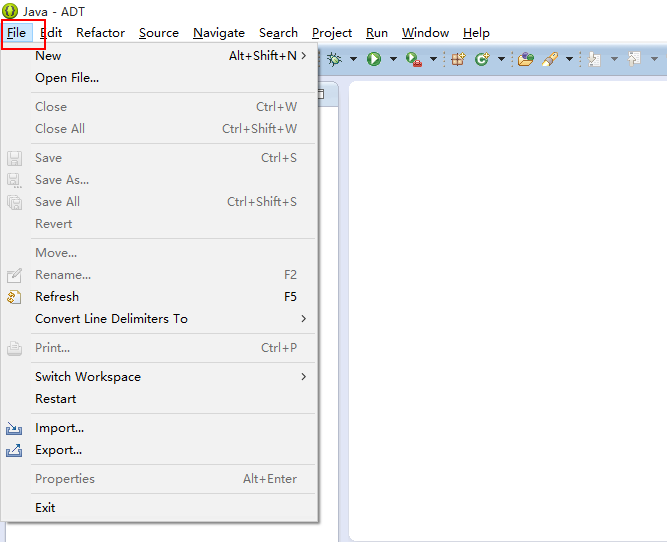
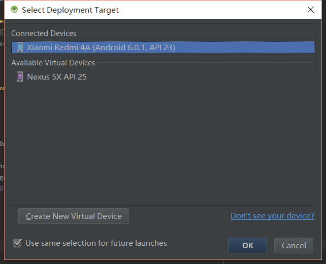

# 附录A：如何在Android Studio中进行真机测试

## 打开USB调试
首先找到手机设置“开发者选项”的地方(有的手机默认不会显示开发者选项，读者可以百度XX手机如何开启USB调试)，开启“开发者选项”，并打开“USB调试”。 
  

接下来，需要安装手机的驱动，每个手机生产厂家都不一样，如果电脑装了360助手、金山手机助手的话会自行安装驱动。

此时我们打开Android Studio，点击运行程序，然后会跳出来选择设备的窗口，我们查看手机，会提示需要我们的手机授权。 
  

## 运行程序
在手机上点击同意之后，如果在设备选择处看到了自己的手机，就说明配置成功了。 
  

然后选择运行，程序就可以跑在自己的手机上了。
