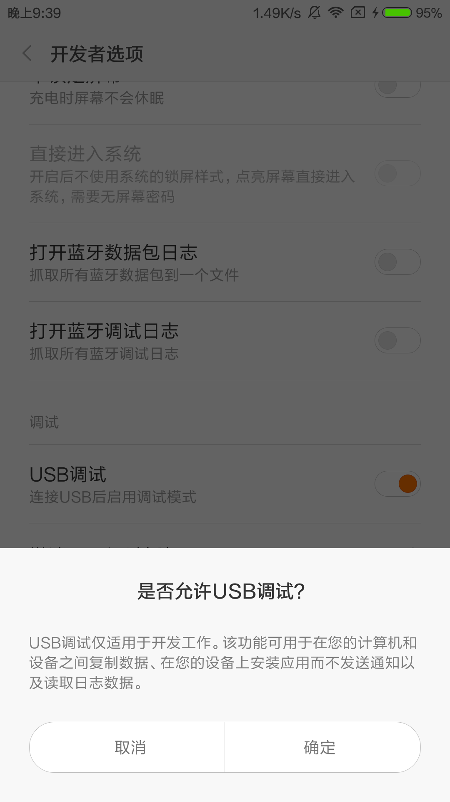
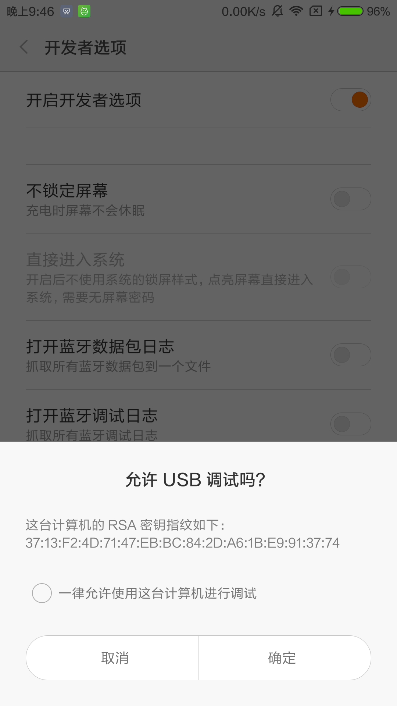
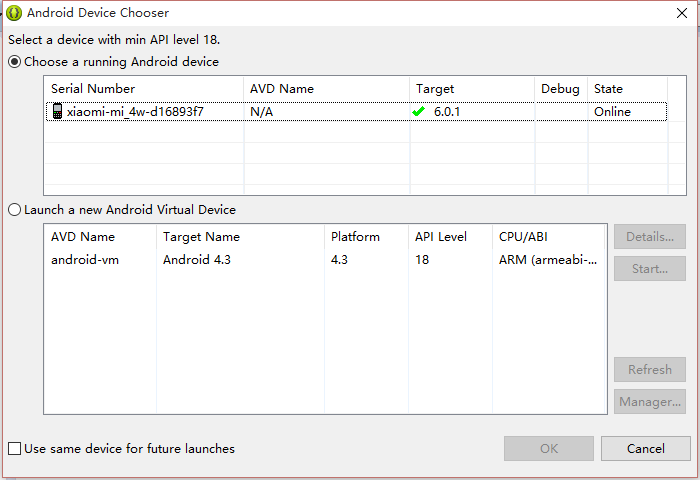

# 附录B: 如何在安卓中进行真机测试

## 打开USB调试
首先找到手机设置“开发者选项”的地方(有的手机默认不会显示开发者选项，读者可以百度一下)，开启“开发者选项”，并打开“USB调试”。 
  

接下来，需要安装手机的驱动，每个手机生产厂家都不一样，如果电脑装了360助手或者金山手机助手的话会自行安装驱动。

此时我们打开Eclipse，如果可以看到下面的图，就说明驱动安装成功了。 
  

接下来，我们运行程序，会看到弹出一个选择机器的窗口，如果你看到自己的手机型号出现，就说明成功了。 
  
