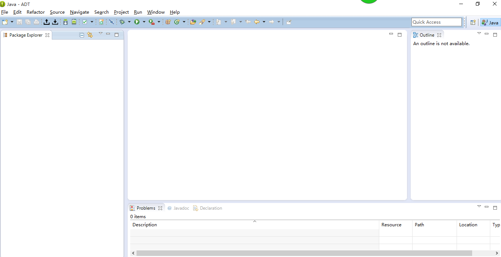

# 附录A: 如何导入别人的安卓工程

首先打开eclipse。 
  

点击上边导航栏的File。 
  

点击Import。 
  

选择Android下的“Existing Android Code Into Workspace”，点击Next。 
  

点击Next后，会看到有个Browse按钮。 
  

点击它，并选择源码文件夹。 
  

点击确定之后，eclipse就会搜索此文件夹下的所有安卓项目，可以看到要导入项目的名称。 
  

此时点击Finish，就可以看到导入的项目了。 
  
